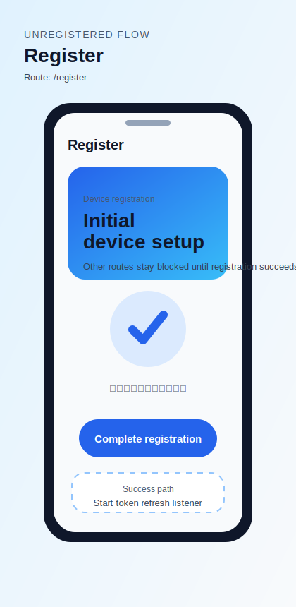
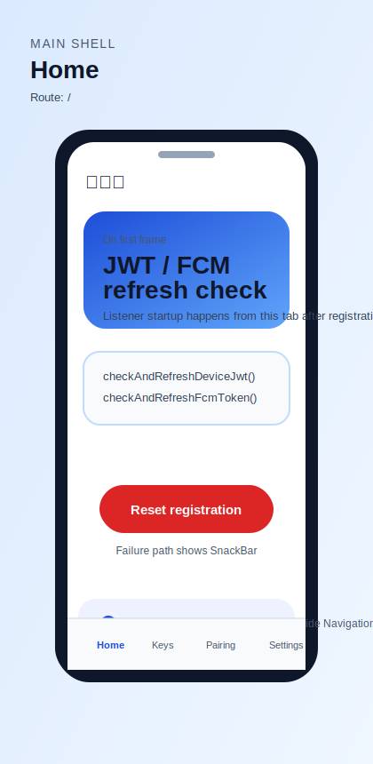
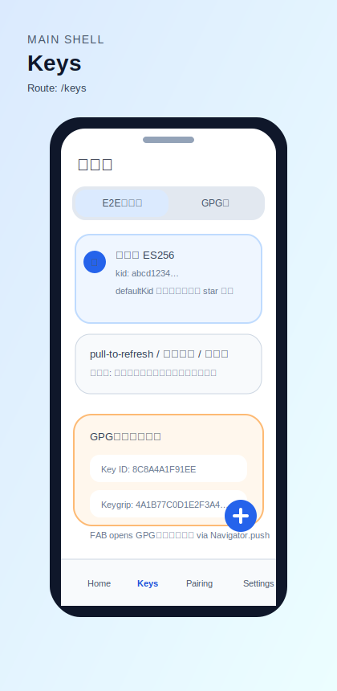
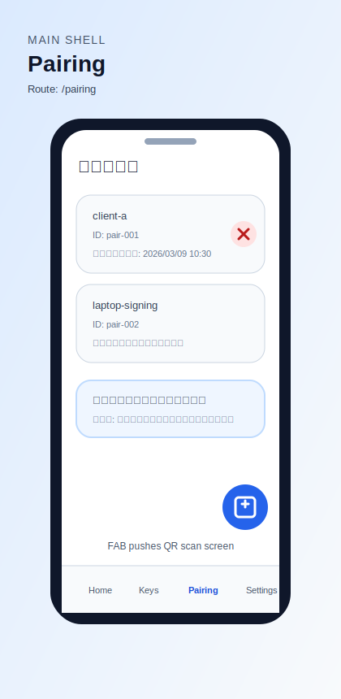
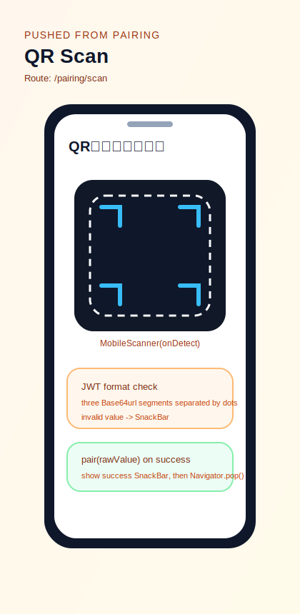
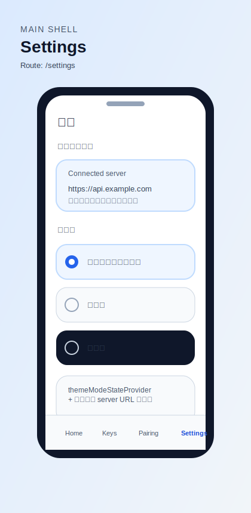
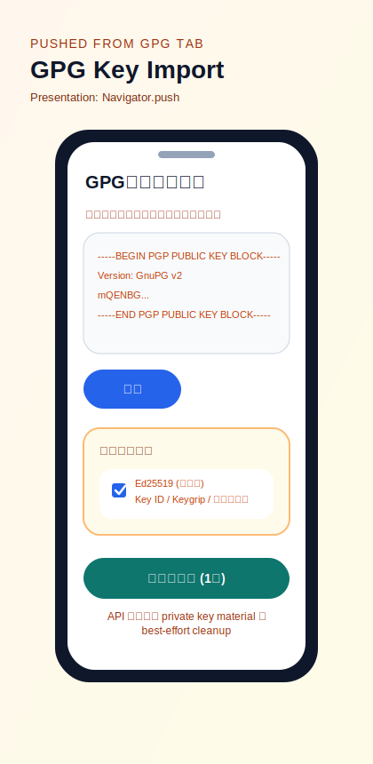
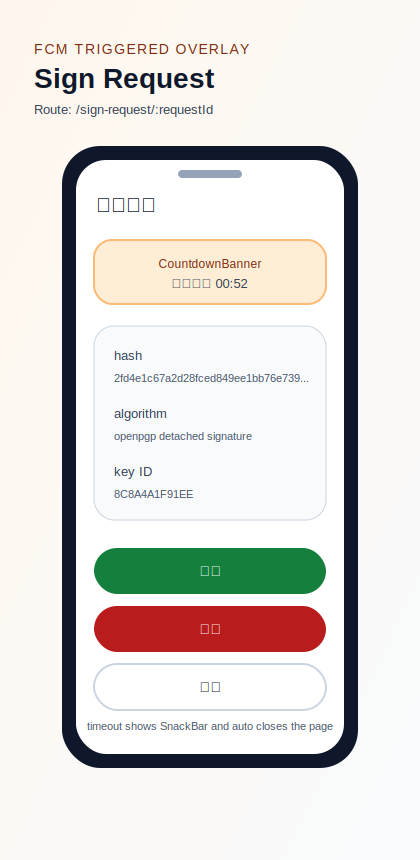

# Mobile Screen Design

現在の Flutter 実装に存在する主要画面を、設計レビュー向けに簡潔に整理した文書です。対象は `mobile/lib/main.dart`、`mobile/lib/router`、`mobile/lib/pages` 配下の実装済み画面です。

## Visual Overview

画面モックは外部 SVG として `assets/mobile-screen-design/` 配下に分離しています。以下の画像は現在の Flutter 実装に存在するラベル、導線、状態をベースにしたレビュー用モックです。

### Register

Asset: [assets/mobile-screen-design/register.svg](assets/mobile-screen-design/register.svg)

未登録端末の初期到達先です。中央の `Complete registration` ボタンと、成功後に token refresh listener を開始する流れを示しています。

### Home

Asset: [assets/mobile-screen-design/home.svg](assets/mobile-screen-design/home.svg)

登録済み端末のホームです。初回表示時の JWT / FCM token 更新確認と、`Reset registration` アクションを表現しています。

### Keys

Asset: [assets/mobile-screen-design/keys.svg](assets/mobile-screen-design/keys.svg)

`/keys` は 1 route 内に `E2E公開鍵` と `GPG鍵` の 2 タブを持つため、モック内でも両方の状態が分かるように並記しています。E2E 鍵の star 表示と、GPG 鍵インポート導線を同一画面内で確認できます。

### Pairing

Asset: [assets/mobile-screen-design/pairing.svg](assets/mobile-screen-design/pairing.svg)

ペアリング済みデバイス一覧、解除導線、`/pairing/scan` へ進む QR スキャン FAB を表現しています。

### QR Scan

Asset: [assets/mobile-screen-design/qr-scan.svg](assets/mobile-screen-design/qr-scan.svg)

カメラスキャン、JWT 形式検証、成功時の復帰、無効な値への SnackBar を中心に整理しています。

### Settings

Asset: [assets/mobile-screen-design/settings.svg](assets/mobile-screen-design/settings.svg)

現行実装どおり、テーマ切替 3 選択肢のみを持つシンプルな設定画面です。

### GPG Key Import

Asset: [assets/mobile-screen-design/gpg-key-import.svg](assets/mobile-screen-design/gpg-key-import.svg)

`Navigator.push` で開く補助画面です。アーマード鍵の貼り付け、解析、検出鍵の選択、インポート実行の 4 段階を 1 枚で把握できるようにしています。

### Sign Request

Asset: [assets/mobile-screen-design/sign-request.svg](assets/mobile-screen-design/sign-request.svg)

FCM 起点で一時的に表示される署名要求画面です。残り時間バナー、詳細カード、承認 / 拒否 / 無視の操作を明示しています。

### Flow Summary

- Register 完了後に MainShell へ遷移し、Home / Keys / Pairing / Settings を下部ナビゲーションで切り替える。
- Pairing 一覧から QR スキャンへ push 遷移し、結果は SnackBar と前画面復帰で返す。
- Keys の GPG タブから GPG鍵インポートを開き、FCM 受信時には署名要求画面を一時的に push 表示する。

## Navigation Structure

| Screen | Route / Presentation | Entry point |
| --- | --- | --- |
| Register | `/register` | 未登録時の初期到達先 |
| Home | `/` | 登録済み MainShell のタブ |
| Keys | `/keys` | 登録済み MainShell のタブ |
| Pairing | `/pairing` | 登録済み MainShell のタブ |
| QR Scan | `/pairing/scan` | Pairing の FAB |
| Settings | `/settings` | 登録済み MainShell のタブ |
| Sign Request | `/sign-request/:requestId` | FCM 受信時に push |
| GPG Key Import | ルート未定義、`Navigator.push` | Keys の GPG 鍵タブ FAB |

## Screen Notes

### 1. Register

- Purpose: 端末未登録状態でデバイス登録を完了する。
- Key UI elements: AppBar「Register」、中央の登録ボタン、処理中インジケータ。
- Primary actions: Complete registration 実行。
- State / notes: 成功後に token refresh listener を開始。失敗時は SnackBar 表示。未登録時は他ルートへ進めない。

### 2. MainShell

- Purpose: 登録後の主要 4 画面を下部ナビゲーションで切り替える。
- Key UI elements: NavigationBar、4 destinations（ホーム / 鍵管理 / ペアリング / 設定）。
- Primary actions: タブ切替、同一タブ再選択時はその branch の初期位置へ戻る。
- State / notes: `StatefulShellRoute.indexedStack` により各 branch の状態を保持する構成。

### 3. Home

- Purpose: 登録済み端末のホーム。現状は登録解除の起点。
- Key UI elements: AppBar「ホーム」、中央の Reset registration ボタン、処理中インジケータ。
- Primary actions: 登録解除。
- State / notes: 初回表示後に device JWT 更新確認、FCM token 更新確認、token refresh listener 開始。解除失敗は SnackBar 表示。

### 4. Keys

- Purpose: E2E 公開鍵と GPG 鍵の管理を 1 画面で扱う。
- Key UI elements: AppBar「鍵管理」、TabBar、TabBarView。
- Primary actions: タブ切替。
- State / notes: 画面自体はコンテナで、実操作は各タブ側にある。

### 5. E2E Keys Tab

- Purpose: サーバーに登録済みの E2E 公開鍵一覧確認と追加・削除。
- Key UI elements: ローディング表示、エラー表示と再試行、空状態メッセージ、鍵カード一覧、デフォルト鍵の star アイコン、追加 FAB。
- Primary actions: 一覧再読込、鍵ペア生成、鍵削除。
- State / notes: pull-to-refresh 対応。削除前に確認ダイアログ表示。`use` に応じて「認証用 / 暗号化用」を表示。

### 6. GPG Keys Tab

- Purpose: GPG 鍵一覧の確認、削除、インポート画面への遷移。
- Key UI elements: ローディング表示、エラー表示と再試行、空状態メッセージ、鍵カード一覧、インポート FAB。
- Primary actions: 一覧再読込、鍵削除、GPG 鍵インポート画面を開く。
- State / notes: pull-to-refresh 対応。削除前に確認ダイアログ表示。Keygrip は短縮表示。

### 7. GPG Key Import

- Purpose: アーマード鍵テキストを解析し、選択した鍵を端末保管とサーバー登録へ取り込む。
- Key UI elements: AppBar「GPG鍵インポート」、複数行 TextField、解析ボタン、解析エラー表示、検出鍵のチェックリスト、インポートボタン。
- Primary actions: 鍵文字列の解析、検出鍵の選択、インポート実行。
- State / notes: 鍵未入力・解析失敗・インポート失敗を明示。秘密鍵素材の保存後に API 登録し、API 失敗時はベストエフォートでロールバック。

### 8. Pairing

- Purpose: ペアリング済みデバイス一覧の確認と解除、QR スキャンへの導線提供。
- Key UI elements: AppBar「ペアリング」、ローディング表示、エラー表示と再試行、空状態メッセージ、一覧タイル、削除アイコン、QR スキャン FAB。
- Primary actions: 一覧再読込、ペアリング解除、QR スキャン画面へ遷移。
- State / notes: 各タイルで解除中スピナーを表示。解除前に確認ダイアログ表示。日時は `YYYY/MM/DD HH:mm` 形式。

### 9. QR Scan

- Purpose: QR コードから pairing JWT を読み取り、ペアリングを完了する。
- Key UI elements: AppBar「QRコードスキャン」、カメラスキャンビュー、処理中インジケータ。
- Primary actions: QR 検出、JWT 形式検証、ペアリング実行。
- State / notes: JWT 形式でない場合は即座に SnackBar。成功時は成功通知後に前画面へ戻る。失敗時はエラー通知後に再スキャン可能。

### 10. Settings

- Purpose: アプリテーマを切り替える。
- Key UI elements: AppBar「設定」、テーマ見出し、3 つの RadioListTile。
- Primary actions: システム設定 / ライト / ダークの選択。
- State / notes: 永続化は `themeModeStateProvider` 経由。現時点の設定 UI はテーマ切替のみ。

### 11. Sign Request

- Purpose: 署名要求の内容確認と承認判断。
- Key UI elements: AppBar「署名要求」、残り時間バナー、署名詳細カード、承認 / 拒否 / 無視ボタン。
- Primary actions: 承認、拒否、無視。
- State / notes: FCM 受信時に push 表示される一時画面。読み込み中、エラー、要求未発見に対応。残り 60 秒未満でバナーが警告色になり、期限切れ時は SnackBar を出して自動で閉じる。

## Review Notes

- 現在の画面導線は「未登録フロー」「MainShell 配下の 4 タブ」「一時的に開く補助画面」に大別できる。
- 鍵管理は 1 route 内に 2 タブと 1 サブ画面を持つため、レビュー時は `Keys` を単一画面ではなく画面群として扱うほうが分かりやすい。
- 確認ダイアログや SnackBar は複数画面で使われるが、本書では独立 screen ではなく各画面の state/notes に含めた。
