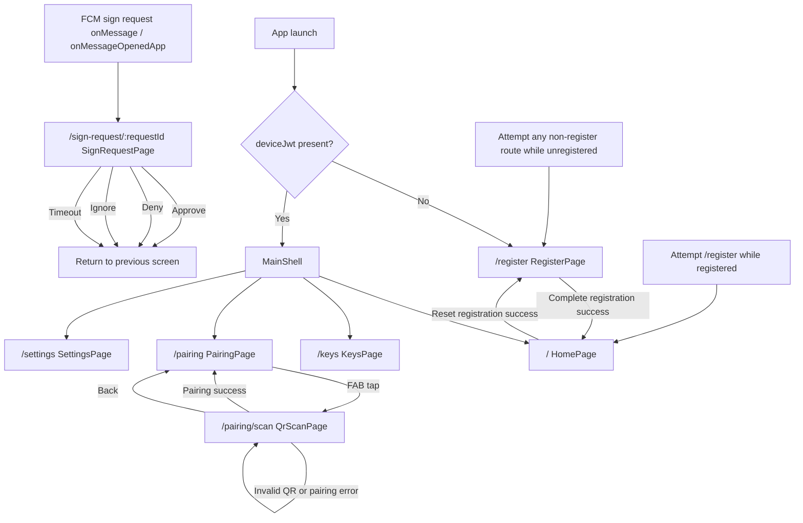

# Mobile App Screen Transition

現在のモバイル実装に基づく、主要画面のルート構成と画面遷移の整理です。

## 主要画面

- `/register`: 未登録端末向けの初期登録画面
- `/`: 登録済み端末向けホーム画面
- `/keys`: 鍵管理画面。内部で `E2E公開鍵` と `GPG鍵` のタブを切り替える
- `/pairing`: ペアリング一覧画面
- `/pairing/scan`: QR スキャン画面
- `/settings`: 設定画面
- `/sign-request/:requestId`: 署名要求確認画面

## Mermaid 図

## 入口条件とリダイレクト

- アプリ起動時の初期ロケーションは `/register`。
- ただし実際の到達先は `authStateProvider` の結果で決まり、セキュアストレージ内の `deviceJwt` が存在しない場合は `/register` に固定される。
- 未登録状態で `/register` 以外へ入ろうとした場合は `/register` にリダイレクトされる。
- 登録済み状態で `/register` に入ろうとした場合は `/` にリダイレクトされる。
- 登録済み画面群は `StatefulShellRoute.indexedStack` で構成され、下部ナビゲーションから `ホーム / 鍵管理 / ペアリング / 設定` を切り替える。

## 注目フロー

- 初回登録は `/register` で完了し、登録状態更新後はリダイレクトにより `/` へ遷移する。現在の実装では登録先サーバーは Register 画面で入力せず、`API_BASE_URL` の dart-define を `ApiConfig.baseUrl` として読み込んだ build-time config が `Dio` の base URL として使われる。
- 提案設計では `/register` 表示時にサーバー URL を確認または編集できる入力欄を追加し、初期値には `API_BASE_URL` を使う。
- 提案設計ではユーザーが確定したサーバー URL を検証したうえで `POST /device` を実行し、成功後はその URL を永続化して以後の API 呼び出しで使う。
- 提案設計の対象は初回登録時のサーバー確定までとし、登録後のサーバー切り替えは再登録を伴う別タスクとして扱う。
- ホーム画面の `Reset registration` 実行後は登録情報が削除され、ルータの再評価で `/register` に戻る。
- ペアリング画面からのみ `/pairing/scan` へ遷移でき、成功時は `pop` で一覧へ戻る。
- 署名要求画面は通常の下部ナビゲーション遷移ではなく、FCM メッセージ受信時に `requestId` 付きで `push` される一時画面として扱われる。
- 署名要求画面では承認・拒否・無視・タイムアウトのいずれでも画面を閉じ、直前の画面に戻る。

## Register 改善フロー [提案]

- App launch 後に未登録と判定された場合は `/register` を表示する。
- Register 画面では `API_BASE_URL` を初期値としてサーバー URL を提示し、ユーザーはそのまま使うか別サーバーへ編集できる。
- `Complete registration` 実行前に入力値の形式と接続可否を検証し、最低限 `https://` 前提の URL 検証と疎通確認に通ったサーバーのみ登録先として採用する。具体的な検証エンドポイントとタイムアウト値は後続タスクで確定する。
- 登録成功時は選択したサーバー URL を永続化し、device JWT や関連トークンと同様に後続セッションで再利用する。
- 登録失敗時は現在と同様にエラーを表示し、サーバー URL の確認から再試行できるようにする。

## 実装上の補足

- 署名要求のルートは定義されているが、現在の UI 上で明示的にそこへ移動するボタンはない。
- 署名要求画面への自動遷移は `FirebaseMessaging.onMessage` と `FirebaseMessaging.onMessageOpenedApp` に実装されている。
- 現在の実装には `FirebaseMessaging.getInitialMessage()` によるコールドスタート時の復元導線は見当たらない。
- `KeysPage` の 2 タブはルート分割ではなく、単一画面内のタブ切り替えとして実装されている。
- Register 画面には接続先サーバーを指定する入力 UI はなく、`ApiConfig -> httpClientProvider -> deviceApiProvider -> DeviceRegistrationService` の経路で `API_BASE_URL` が `POST /device` の送信先に反映される。
- Register のランタイムサーバー選択は未実装であり、実装時には保存済みサーバー URL を `Dio` の base URL と JWT audience の両方へ反映する必要がある。