# 📋 GPG署名システム - 要求定義・要件定義

## 1. プロジェクト概要

**プロジェクト名**: リモートGPG署名システム  
**目的**: PC上のGPGエージェント互換のデーモンがスマホ内の秘密鍵を使用して署名を行うシステム  
**主な課題解決**: 秘密鍵をPCに保有せず、スマホで安全に管理しながらPC側からのGPG署名要求に対応

---

## 2. ユーザー要求（Business Requirements）

### 2.1 基本要件
- PC上で通常のGPGコマンドを使用しながら、署名処理をスマホに委譲したい
- 秘密鍵はスマホのセキュアストレージにのみ保管したい
- PCとスマホを使用した署名フローは対話的で、ユーザーが署名を承認する必要がある

### 2.2 運用要件
- PC側で署名要求を送信後、スマホで承認するまで待機できる環境が必要
- Agentとスマホを端末単位でペアリングして運用したい
- 複数端末（複数Agent・複数スマホ）を独立にペアリング管理したい
- 署名要求の有効期限管理が必要

### 2.3 セキュリティ要件
- PC側にGPG秘密鍵が存在しないこと
- 秘密鍵はスマホ内でのみ保有されること
- PC・スマホ・サーバー間の通信は認証・暗号化されていること
- 署名要求と署名結果の対応関係が検証可能であること
- 署名対象データ（ハッシュ）はWebサーバーが閲覧不可であること（Daemon↔スマホ間のE2E暗号化）

---

## 3. 機能要件（Functional Requirements）

### 3.1 PC側機能
| 機能                        | 説明                         |
| ------------------------- | -------------------------- |
| **gpg-agent互換CLI daemon** | PC側で動作し、GPGのIPC要求に応答       |
| **Assuanプロトコル実装**         | gpg-agentとの互換性確保（署名・鍵照会サブセット） |
| **署名要求送信（Phase 1）**       | client_jwtを提示しE2E公開鍵を取得    |
| **E2E暗号化・送信（Phase 2）**    | スマホのE2E公開鍵でハッシュをJWE暗号化し送信 |
| **結果の待機**                 | SSEでスマホ承認結果を受信             |
| **署名結果の返却**               | GPGコマンドへ署名結果を返す            |
| **鍵照会応答**                 | HAVEKEY/KEYINFO/READKEYへの応答（Webサーバーから取得したGPG鍵情報を返却） |
| **GPG鍵情報取得**             | POST /pairing/gpg-keysでサーバーからGPG公開鍵を取得し、プロセス内メモリに揮発性キャッシュとして保持 |
| **client_jwt自動更新**       | 残り有効期間が1/3未満でPOST /pairing/refreshを呼び出し更新 |

### 3.2 Webサーバー機能
| 機能             | 説明                                         |
| -------------- | ------------------------------------------ |
| **デバイス管理**    | デバイストークン登録・更新・削除の処理（POST/PATCH/DELETE /device） |
| **公開鍵管理**    | デバイス公開鍵の追加・一覧取得・削除（POST/GET/DELETE /device/public_key） |
| **GPG公開鍵管理** | GPG公開鍵の登録・一覧取得・削除（POST/GET/DELETE /device/gpg_key）およびDaemonへの鍵情報提供（POST /pairing/gpg-keys） |
| **device_jwt更新** | スマホからのdevice_jwt更新要求を処理（POST /device/refresh） |
| **署名要求受け取り**  | PCからのPOST /sign-requestを処理（2フェーズ）           |
| **E2E公開鍵配信**  | 署名要求Phase 1でDaemonへスマホのE2E公開鍵を返却         |
| **暗号化ペイロード保存** | Phase 2で受信したE2E暗号化データを保存・配信             |
| **署名要求配信**    | スマホへのGET /sign-requestでE2E暗号化済み署名要求を提供   |
| **要求状態管理**    | requests のライフサイクルと署名状態を管理                 |
| **ペアリング受付**   | device_assertion_jwt検証・pairing_jwt検証によるペアリング確定        |
| **ペアリング解除**  | スマホからのペアリング解除要求を処理（DELETE /pairing/{pairing_id}） |
| **client_jwt更新** | Daemonからのclient_jwt更新要求を処理（POST /pairing/refresh） |
| **FCMプッシュ**   | スマホアプリへの通知送信（署名要求通知・署名要求キャンセル通知）             |
| **署名結果受け取り**  | スマホからのPOST /sign-resultを処理                 |
| **署名結果確定後のキャンセル通知** | 署名結果確定時に結果送信元以外のデバイスへFCMキャンセル通知を送信 |
| **SSEプッシュ**   | PC向けのイベント配信（ペアリング完了・署名結果）                 |
| **JWT管理**     | device_jwt・pairing_jwt・client_jwt・request_jwt・sign_jwtの発行・検証 |
| **ヘルスチェック** | サーバー稼働状態確認エンドポイント（GET /health） |

### 3.3 スマホアプリ機能
| 機能                  | 説明                              |
| ------------------- | ------------------------------- |
| **デバイス登録/更新**      | FCMトークンとFIDの初期登録・FCMトークン更新         |
| **FCMトークン確認** | アプリ起動時（Push通知経由の起動を除く）にFCMトークンを取得し、保持値と差異があればPATCH /deviceで更新。Push通知経由の起動時はトークンが有効なことが保証されるため確認不要 |
| **device_jwt自動更新** | 残り有効期間が1/3未満でPOST /device/refreshを呼び出し更新 |
| **ペアリング実行**        | QR経由のpairing_jwtでDaemonとペアリング    |
| **ペアリング管理** | pairing_idのローカル保存・署名要求時のpairing_id検証・ペアリング解除（サーバー側DELETE /pairing/{pairing_id}＆ローカル削除） |
| **GPG鍵登録**           | GPG秘密鍵に対応する公開鍵情報をサーバーに登録・管理（POST/GET/DELETE /device/gpg_key） |
| **プッシュ通知受信**       | 署名要求の受信                         |
| **署名要求取得**         | device_assertion_jwtでWebサーバーからE2E暗号化済み署名要求を取得（アプリ起動時にも実行し、FCM未達時のフォールバックとして機能） |
| **E2E復号**           | 暗号化された署名データをローカルのE2E秘密鍵で復号  |
| **ユーザー承認UI**       | 署名内容確認・承認/拒否の判断                 |
| **署名実行**           | ローカルの秘密鍵で署名生成                   |
| **署名要求キャンセル処理** | FCMキャンセル通知受信時またはPOST /sign-result 409受信時に承認UIを閉じ「他デバイスで処理済み」を表示 |
| **署名結果送信**         | sign_jwtでWebサーバーへ署名結果POST     |

### 3.4 エラーハンドリング・リトライ機能
| 機能             | 説明                           |
| -------------- | ---------------------------- |
| **タイムアウト検知**   | 署名要求のタイムアウト（5分）を自動検知         |
| **失敗通知**       | PCへ署名失敗・拒否・タイムアウト通知          |
| **エラーログ記録**    | 全エラーイベントを監査ログに記録             |
| **リトライ制御**     | タイムアウト後の再試行はユーザー手動（自動リトライなし） |
| **失敗時クリーンアップ** | 期限切れ要求の自動削除                  |

---

## 4. 非機能要件（Non-Functional Requirements）

### 4.1 パフォーマンス
- Phase 2完了（PATCH /sign-requestレスポンス）からスマホへのFCMプッシュ配信: **1秒以内**
- スマホからの署名結果のPC への到達: **5秒以内**（ネットワーク遅延含む）
- PC側の署名要求からスマホへのプッシュ配信（Phase 1 + Daemon側暗号化 + Phase 2 + FCM送信）: **3秒以内**（目標値）
- Webサーバーの同時接続数: **最低100接続**

> [!NOTE]
> 「PC側の署名要求からスマホへのプッシュ配信」は以下の全工程を含むため、1秒以内の達成は困難:
> 1. Phase 1: POST /sign-request（HTTP RTT + サーバー処理）
> 2. Daemon側: E2Eエフェメラル鍵生成 + JWE暗号化処理（数十～数百ms）
> 3. Phase 2: PATCH /sign-request（HTTP RTT + サーバー処理）
> 4. FCM Push送信（数百ms～数秒）
>
> このため、エンドツーエンドの目標値を3秒以内とし、Phase 2完了後のFCM配信は1秒以内を保証する。

### 4.2 可用性
- Webサーバーの稼働率: **99.5%** 以上
- スマホアプリのクラッシュ率: **0.1%** 未満
- 署名タイムアウト: **5分**（設定可能）

### 4.3 スケーラビリティ
- ステートレス指向のWebサーバー設計
- 水平スケーリング対応（requests を共有DBで管理）
- 複数PC・複数スマホの同時接続対応

### 4.4 信頼性
- 署名要求と結果の対応一意性保証
- 署名結果の完全性確認（JWT署名）
- 要求タイムアウト時の自動クリーンアップ

### 4.5 レート制限（Rate Limiting）

全APIエンドポイントに対してIPアドレス単位のレート制限を適用する。認証なしエンドポイント（ヘッダー認証もbody内認証もないもの）には厳しい制限を設定し、認証ありエンドポイント（ヘッダー認証またはbody内認証）には標準的な制限を適用する。

#### レート制限ティア

| ティア | 対象エンドポイント | 制限値（目安） | 設計理由 |
| --- | --- | --- | --- |
| **厳格（Strict）** | `POST /device`, `GET /pairing-token` | 10 req/min/IP | 認証なしエンドポイント。大量登録攻撃・大量トークン生成攻撃を防止 |
| **標準（Standard）** | 上記以外の全エンドポイント | 60 req/min/IP | 認証ありエンドポイント。正常利用を阻害しない範囲で保護 |

> [!NOTE]
> `DELETE /pairing`（Daemon側）・`POST /sign-request`・`POST /pairing/refresh`・`POST /pairing/gpg-keys` はOpenAPI上 `security: []`（ヘッダー認証なし）だが、body内のclient_jwt（JWS+JWE）による認証が存在するため、標準ティアを適用する。これらのエンドポイントはサーバー側でclient_jwtの署名検証・暗号化復号によりリクエスト元を特定できるため、完全な未認証エンドポイントとは異なる。

> [!NOTE]
> `GET /health` は認証なしエンドポイントだが、リソース作成を行わないため、大量登録攻撃等の脅威が低く、標準ティアを適用する。厳格ティアの対象はリソース作成を伴う認証なしエンドポイント（`POST /device`, `GET /pairing-token`）に限定する。

> [!NOTE]
> 制限値は運用開始後のトラフィック分析に基づいて調整する。上記はv1.0リリース時の初期値の目安であり、設定値として外部化する。

#### アプリケーションレベルの論理的制限
IPベースのレート制限に加え、以下のアプリケーションレベルの論理的制限も併用する:

| エンドポイント | 制限条件 | 初期目安 | 応答 | 設計理由 |
| --- | --- | --- | --- | --- |
| `GET /pairing-token` | `client_id==null`の未消費ペアリングレコードが上限以上 | 100件 | 429 | 大量トークン生成攻撃防止。同時接続上限（100接続）と同等に設定 |
| `POST /sign-request` | 同一`client_id`かつ同一`pairing_id`の未完了要求（created/pending）が上限以上 | 5件 | 429 | 悪意client_jwtによるリソース枯渇攻撃防止。単一ペアリングで並行する署名要求は通常1件のため余裕を持たせた値 |

> [!NOTE]
> これらの論理的制限はIPベースのレート制限とは独立して動作し、いずれかの制限に到達した時点で429を返却する。初期目安値は運用開始後のトラフィック分析に基づいて調整する（設定値として外部化）。

#### SSEエンドポイント向け接続制御
長時間接続のSSEエンドポイント（`GET /pairing-session`, `GET /sign-events`）には、通常のreq/min制限に加えて接続数ベースの制御を適用する。

| 対象 | 制限条件 | 初期目安 | 応答 | 設計理由 |
| --- | --- | --- | --- | --- |
| `GET /pairing-session`, `GET /sign-events` | 同一IPの同時SSE接続数が上限超過 | 20接続/IP | 429 | 短時間再接続集中時の接続枯渇防止 |
| `GET /pairing-session` | 同一`pairing_jwt`での同時接続数が上限超過 | 1接続 | 429 | 同一待機セッションの重複接続防止 |
| `GET /sign-events` | 同一`request_id`での同時接続数が上限超過 | 1接続 | 429 | 同一署名待機セッションの重複接続防止 |

> [!NOTE]
> SSE接続制御により429を返却する場合も `Retry-After` を返却し、クライアントは `Retry-After` を最小待機時間として再接続する。

#### レスポンスヘッダ
レート制限の状態はRFC 6585（429ステータスコード）およびdraft-ietf-httpapi-ratelimit-headers（RateLimit関連ヘッダ）に基づくレスポンスヘッダで通知する:
- `RateLimit-Policy`: レート制限ポリシーの定義（SF-Dictionary形式。クォータ`q`とウィンドウ幅`w`）。例: `"default";q=100;w=60`
- `RateLimit`: 現在のレート制限状態（SF-Dictionary形式。残りクォータ`r`とリセットまでの秒数`t`）。例: `"default";r=50;t=30`
- `Retry-After`: 429応答時、再試行可能になるまでの秒数（RFC 9110 Section 10.2.3）

> [!NOTE]
> API契約として `RateLimit-Policy` / `RateLimit` / `Retry-After` を必須で返却するのは429応答時とする。非429応答で `RateLimit-Policy` / `RateLimit` を返却するかは実装依存（任意）とする。

#### 実装方針
- **ミドルウェア方式**: axumのミドルウェアレイヤーで実装し、各ハンドラに依存しない横断的な制御を行う
- **ストレージ**: v1.0ではインメモリ（プロセス内）のスライディングウィンドウ方式。スケールアウト時（v2.0以降）はRedis等の共有ストアに移行
- **IPアドレス取得**: `X-Forwarded-For` ヘッダ（Fly.ioリバースプロキシ経由）を使用し、信頼できるプロキシからのヘッダのみ採用

---

## 5. システム要件（System Requirements）

### 5.1 アーキテクチャ
| コンポーネント       | 役割            | 技術スタック        |
| ------------- | ------------- | ------------- |
| **PC daemon** | GPG互換インターフェース | Rust / CLI    |
| **Webサーバー**   | オーケストレーション層   | Rust / axum   |
| **スマホアプリ**    | ユーザーインターフェース  | iOS / Android |

### 5.2 通信プロトコル
| 区間            | プロトコル          | 認証                                  | 用途          |
| ------------- | -------------- | ----------------------------------- | ----------- |
| **スマホ → Web** | HTTP POST/PATCH | なし / device_assertion_jwt                | デバイス登録/更新  |
| **スマホ → Web** | HTTP DELETE     | device_assertion_jwt                      | デバイス削除     |
| **スマホ → Web** | HTTP POST       | device_assertion_jwt                      | device_jwt更新   |
| **スマホ → Web** | HTTP POST/GET/DELETE | device_assertion_jwt                 | 公開鍵管理     |
| **スマホ → Web** | HTTP POST/GET/DELETE | device_assertion_jwt                 | GPG公開鍵管理  |
| **PC → Web**  | HTTP GET       | なし                                  | ペアリングToken取得 |
| **PC ↔ Web**  | HTTP GET (SSE) | Bearer pairing_jwt                   | ペアリング待機    |
| **スマホ → Web** | HTTP POST      | device_assertion_jwt（body: pairing_jwt）    | ペアリング実行    |
| **PC → Web**  | HTTP POST      | client_jwt (JWS+JWE, body内)            | client_jwt更新   |
| **PC → Web**  | HTTP DELETE    | client_jwt (JWS+JWE, body内)            | ペアリング解除   |
| **PC → Web**  | HTTP POST      | client_jwt (JWS+JWE, body内リスト)         | 署名要求送信 (Phase 1) |
| **PC → Web**  | HTTP POST      | client_jwt (JWS+JWE, body内リスト)         | GPG公開鍵取得    |
| **PC ← Web**  | HTTP POST res  | なし（Phase 1レスポンス）          | E2E公開鍵取得     |
| **PC → Web**  | HTTP PATCH     | Bearer daemon_auth_jws（Daemon認証用一時鍵で署名、内部にrequest_jwt） | E2E暗号化データ送信 (Phase 2) |
| **スマホ → Web** | HTTP GET       | device_assertion_jwt                      | 署名要求取得（E2E暗号化済み） |
| **PC ← Web**  | HTTP GET (SSE) | Bearer daemon_auth_jws（Daemon認証用一時鍵で署名、内部にrequest_jwt） | 署名結果受信     |
| **スマホ → Web** | HTTP POST      | Bearer sign_jwt                      | 署名結果送信     |
| **Web → スマホ** | FCM            | OAuth2.0 Access Token                | プッシュ通知（署名要求・キャンセル） |

### 5.3 認証モデル

#### デバイス認証
- **方式**: OIDC Client Authentication（private_key_jwt方式） + device_jwt（JWS、サーバーが署名）
- **用途**: スマホデバイスの初回登録後の認証
- **device_jwt発行タイミング**: `POST /device`（初回登録時にサーバーが発行。スマホはFIDの確認用として保持）
- **device_jwt要件**: `sub=<fid>`, `payload_type="device"`, `exp=<サーバー設定値（例: 365日）>`
- **有効期限**: `exp` はサーバー設定値（例: 365日）。スマホはdevice_jwtの `exp` を読み取り可能
- **自動更新**: スマホは残り有効期間が全体の1/3未満（例: 365日有効なら残り122日未満）になった時点で `POST /device/refresh` を呼び出し、新しいdevice_jwtを取得する
- **期限切れ時の挙動**: device_jwtの `exp` 超過時、サーバーはデバイス認証で **401 Unauthorized** を返却。スマホはデバイス再登録（`POST /device`）を実行して新しいdevice_jwtを取得する必要がある
- **認証対象エンドポイント**: `PATCH /device`, `POST /device/public_key`, `GET /device/public_key`, `DELETE /device/public_key/{kid}`, `POST /device/gpg_key`, `GET /device/gpg_key`, `DELETE /device/gpg_key/{keygrip}`, `POST /pairing`, `DELETE /pairing/{pairing_id}`, `GET /sign-request`, `POST /device/refresh`
- **device_assertion_jwt認証方式**: 上記エンドポイントでは、スマホがリクエストごとにdevice_assertion_jwt（OIDCのclient assertionに相当するJWT、ES256署名）を生成し、Bearerトークンとして送信する。サーバーはdevice_assertion_jwtの`sub`からFIDを特定し、`clients.public_keys`に登録された公開鍵で署名を検証する
- **device_assertion_jwt構造**: `iss=<fid>`, `sub=<fid>`, `aud=<endpoint_url>`, `exp=<短期限(60秒)>`, `iat=<現在時刻>`, `jti=<一意識別子(UUID)>`
- **リプレイ防止**: `jti`の一意性をサーバー側で検証（有効期限内の`jti`重複を拒否）
- **漏洩時の影響と対策**: device_jwtが漏洩しても、device_assertion_jwtの生成にはスマホ内の秘密鍵（Android Keystore / iOS Secure Enclave）が必要なため、攻撃者は認証を突破できない。device_jwt単体ではペアリング操作も署名要求取得も不可。また、`exp` による有効期限が設定されているため、漏洩したdevice_jwtのFID情報参照可能期間も有限となる

#### ペアリング前（初期登録）
- **方式**: Webが短期有効なpairing_jwt（JWS）を発行し、pairingsテーブルに状態を記録
- **用途**: DaemonがQR表示し、スマホが読み取り
- **要件**: `sub=<UUID>`, `payload_type="pairing"`, 短期限（300秒）、ワンタイム利用
- **ワンタイム保証**: `GET /pairing-token` でpairingsレコードを作成（`client_id=null`）、`POST /pairing` で`client_id`を設定して消費済みとする
- **防御**: `GET /pairing-token` 時に`client_id==null`の未消費レコードが一定数以上存在する場合は発行を拒否
- **クリーンアップ**: `expired`到来時にpairingsレコードを自動削除
- **期限切れ時の挙動**: pairing_jwtの期限切れまたは対応するpairingsレコードの不在時は **410 Gone** を返却する。pairingsレコードは`expired`到来時に物理削除されるため、期限切れはリソースの消滅を意味し、認証失敗（401）ではなくリソース不在（410）が意味論的に適切である。JWT署名検証失敗（フォーマット不正・署名不正）はこれまで通り **401 Unauthorized** を返却する
- **利用エンドポイント**: `GET /pairing-session`（Bearer）, `POST /pairing`（body）
- **QR盗撮リスクへの対策**: pairing_jwtはワンタイム利用のため、第三者が先にペアリングした場合、正規ユーザーのスマホは409 Conflictを受けペアリングできない。この時点でDaemon側のSSE（GET /pairing-session）には`paired`イベントが配信されるが、ユーザーは自身のスマホでペアリングできていないことに気づく。Daemonはペアリング完了時に「ペアリングが完了しました。身に覚えがない場合はペアリングを解除してください」という警告メッセージを表示し、ユーザーが必要に応じて`DELETE /pairing`（Daemon側）または`DELETE /pairing/{pairing_id}`（スマホ側）で不正なペアリングを無効化できる

#### ペアリング後（運用）
- **方式**: Webがclient_jwt（JWS内にJWEをネスト）を発行
- **トークン構造**: 外側JWS（サーバー署名）+ 内側JWE（サーバー自身が暗号化・復号）
  - **外側JWS**: `alg: ES256`、ペイロードに `exp`（有効期限）・`payload_type="client"`・`client_jwe`（内側JWE文字列）を含む
  - **内側JWE**: `alg: ECDH-ES`（Direct Key Agreement）/ `enc: A256GCM`、ペイロードに `sub=<fid>`・`pairing_id=<UUID>` を含む
- **有効期限**: `exp` はサーバー設定値（例: 365日）。Daemonは外側JWSの `exp` を読み取り可能
- **設計理由**: 外側JWSにすることでDaemonが `exp` を参照して自動更新判定が可能。内側JWEの暗号化・復号主体はいずれもWebサーバーのため、鍵配送不要のDirect Key Agreementが最適
- **利用者**: Daemonのみ（外側JWSの `exp` のみ参照し、内側JWEは不透明として保持）
- **サーバー判定軸**: 外側JWSの署名・`exp` を検証後、`client_jwe` を復号してFIDとpairing_idを取得。FIDをclient_idとして使用し、pairing_idが`clients.pairing_ids`に含まれることを検証
- **複数client_jwt送信時の検証方針**:
  - **JWT検証失敗**（JWS署名・exp・JWE復号）: いずれか1つでも失敗した場合、全体を **401 Unauthorized** で拒否する（All-or-nothing）。不正なJWTの混入はクライアント側の実装不備を示唆するため、明示的にエラーとする
  - **サーバー側無効化**（pairing_idがclients.pairing_idsに含まれない等）: 該当client_jwtをフィルタリングし、残りの有効なclient_jwtのみで処理を継続する。ペアリング解除はDaemonが関知できないタイミングで発生し得るため、部分成功を許容する
  - **全てのclient_jwtがフィルタリングされた場合**: 有効なclient_jwtが0件となるため **401 Unauthorized** を返却
- **期限切れ時の挙動**: client_jwtの `exp` 超過時はサーバーが **401 Unauthorized** を返却。Daemonは再ペアリングフローを実行して新しいclient_jwtを取得する必要がある
- **自動更新**: Daemonは残り有効期間が全体の1/3未満（例: 365日有効なら残り122日未満）になった時点で `POST /pairing/refresh` を呼び出し、新しいclient_jwtを取得する
- **利用エンドポイント**: `POST /sign-request`（body内のclient_jwtリスト）、`DELETE /pairing`（Daemon側、body内のclient_jwt）、`POST /pairing/refresh`（body内のclient_jwt）、`POST /pairing/gpg-keys`（body内のclient_jwtリスト）

#### 署名フロー認証（Daemon側）
- **方式**: Webがrequest_jwt（JWS）を署名要求ごとに発行。Daemonは認証用一時鍵ペアでdaemon_auth_jwsを生成して使用
- **トークン**: JWS形式（`sub=<UUID(request_id)>`, `payload_type="request"`）
- **Daemonバインディング**: Phase 1でDaemonが認証用一時EC鍵ペア（ES256）を生成し公開鍵をサーバーに登録。Phase 2以降、request_jwtをDaemonの認証用一時秘密鍵でJWS署名してラップすることで、request_jwtの送信元がPhase 1を開始したDaemonであることを暗号的に保証する
- **利用者**: Daemonのみ（SSE待機）
- **要件**: 署名要求の有効期限（5分）と連動
- **利用エンドポイント**: `PATCH /sign-request`（Bearer daemon_auth_jws）、`GET /sign-events`（Bearer daemon_auth_jws）、`DELETE /sign-request`（Bearer daemon_auth_jws）

##### daemon_auth_jwsの構造
```
外側JWS:
  Header: { "alg": "ES256" }
  Payload: {
    "request_jwt": "<元のrequest_jwt>",
    "aud": "<エンドポイントURL>",  // 対象エンドポイントURL（PATCH /sign-request、GET /sign-events、または DELETE /sign-request）
    "iat": <timestamp>,
    "exp": <timestamp>,  // request_jwtのexpと同じ値
    "jti": "<UUID>"      // リプレイ防止用。サーバーはjtisテーブルで使用済みjtiを管理
  }
  Signature: Daemonの認証用一時秘密鍵で署名
```

##### サーバー検証手順
1. 外側JWSのペイロードをデコード（署名検証は後）し、`request_jwt`を取得
2. 内側`request_jwt`をサーバーの署名鍵で検証し、`request_id`を取得
3. `requests[request_id].daemon_public_key`を取得
4. 外側JWSの署名を`daemon_public_key`で検証
5. 外側JWSの`aud`がリクエスト先のエンドポイントURLと一致することを検証
6. 外側JWSの`exp`の有効期限を検証
7. 外側JWSの`jti`がjtisテーブルに存在しないことを確認（リプレイ防止）し、使用済みとして記録
8. 検証失敗時は **401 Unauthorized** を返却

#### 署名フロー認証（Phone側）
- **方式**: Webがsign_jwt（JWS）を署名要求ごと・デバイスごとに発行
- **トークン**: JWS形式（`sub=<UUID(request_id)>`, `client_id=<fid>`, `payload_type="sign"`）
- **利用者**: スマホのみ（署名結果送信）
- **要件**: 署名要求の有効期限（5分）と連動
- **発行タイミング**: `GET /sign-request` のレスポンス生成時にデバイスごとに発行してスマホに返却（DBへの事前保存不要）
- **設計理由**: DaemonとPhoneで異なるJWTを使用し、payload_typeによる用途分離を徹底する。`client_id`を含めることで、サーバーが署名結果送信元のデバイスを検証可能
- **利用エンドポイント**: `POST /sign-result`（Bearer）

#### E2E暗号化（Daemon↔スマホ間）
- **方式**: JWE（ECDH-ES+A256KW + A256GCM）によるEnd-to-End暗号化
- **目的**: 署名対象データ（ハッシュ・鍵ID）をWebサーバーから秘匿化し、Daemonとスマホのみが平文を取得可能とする
- **鍵管理モードの選定理由**: Direct Key Agreement（ECDH-ES）ではなくKey Wrapping（ECDH-ES+A256KW）を採用。Daemon↔スマホは異なるエンティティであり、CEKをランダム生成してからKEKでラップすることで、E2Eエフェメラル鍵の実装不備時にもCEKの独立性を保証する。client_jwtの内側JWE（サーバー自身が暗号化・復号）はDirect Key Agreementのまま
- **E2E公開鍵の登録**: スマホがデバイス登録時に`use: "enc"`, `alg: "ECDH-ES+A256KW"`, `crv: "P-256"`のEC公開鍵を登録し、`default_kid`でE2E暗号化用の既定鍵を指定
- **鍵の分離**: 認証用公開鍵（`use: "sig"`, ES256）とE2E暗号化用公開鍵（`use: "enc"`, ECDH-ES+A256KW）は別の鍵として管理
- **Daemon側の暗号化手順**:
  1. `POST /sign-request`（Phase 1）でclient_jwtを提示し、各スマホの`default_kid`に基づくE2E公開鍵を取得
  2. リクエストごとにE2Eエフェメラル鍵ペアを生成
  3. 各スマホのE2E公開鍵とE2Eエフェメラル秘密鍵でECDH鍵合意を実行し、共有秘密からKEK（Key Encryption Key）を導出
  4. ランダムにCEK（Content Encryption Key）を生成し、KEKでA256KWラップ
  5. CEKで署名対象データ（E2E平文スキーマ: `{ hash, hash_algorithm, key_id }`）をAES-256-GCM暗号化
  6. E2Eエフェメラル公開鍵をJWEヘッダーの`epk`に含め、ラップ済みCEKをencrypted_keyセグメントに格納し、デバイスごとのJWEを生成
  7. `PATCH /sign-request`（Phase 2）で暗号化済みペイロードを送信
- **スマホ側の復号手順**:
  1. `GET /sign-request`でE2E暗号化済みペイロード（JWE）を取得
  2. JWEヘッダーから`epk`（DaemonのE2Eエフェメラル公開鍵）を抽出
  3. 自身のE2E秘密鍵と`epk`でECDH鍵合意を実行しKEKを導出
  4. JWEのencrypted_keyセグメントからラップ済みCEKを取得し、KEKでA256KWアンラップ
  5. CEKでJWEを復号しE2E平文スキーマ `{ hash, hash_algorithm, key_id }` を取得
- **署名結果の返却パスE2E暗号化**:
  - **目的**: 署名結果（GPG署名データ）をWebサーバーから秘匿化し、スマホとDaemonのみが平文を取得可能とする
  - **方式**: JWE（ECDH-ES+A256KW + A256GCM）。前方向（Daemon→スマホ）と同じアルゴリズムを使用
  - **daemon_enc_public_key**: Daemonが署名要求ごとに生成する返却パスE2E暗号化用一時EC公開鍵（ECDH-ES+A256KW, P-256）。`daemon_public_key`（認証用、ES256）とは別の鍵ペア
  - **スマホ側の暗号化手順**:
    1. `GET /sign-request` で `daemon_enc_public_key` を取得
    2. 返却パス用のE2Eエフェメラル鍵ペアを生成
    3. `daemon_enc_public_key` とE2Eエフェメラル秘密鍵でECDH鍵合意を実行し、KEKを導出
    4. ランダムにCEKを生成し、KEKでA256KWラップ
    5. CEKで署名データをAES-256-GCM暗号化
    6. JWE（ECDH-ES+A256KW + A256GCM）としてシリアライズし、`POST /sign-result` の `signature` フィールドに設定
  - **Daemon側の復号手順**:
    1. SSEで受信した `signature` フィールドからJWEを取得
    2. JWEヘッダーから `epk`（スマホのE2Eエフェメラル公開鍵）を抽出
    3. `daemon_enc_public_key` に対応する秘密鍵と `epk` でECDH鍵合意を実行しKEKを導出
    4. KEKでCEKをアンラップし、CEKでJWEを復号して署名データを取得
- **E2E平文スキーマ**:
  Daemon↔スマホ間でやり取りするJWEの復号後平文は以下のJSON構造とする（詳細はOpenAPI `E2ePlaintextPayload` スキーマを参照）:
  ```json
  {
    "hash": "<Standard Base64エンコードされたバイナリハッシュ>",
    "hash_algorithm": "sha256",
    "key_id": "0xABCD1234EF567890"
  }
  ```
  | フィールド | 型 | 説明 |
  | --- | --- | --- |
  | `hash` | string (Base64) | 署名対象のハッシュ値。AssuanプロトコルのSETHASHから受け取ったバイナリデータをStandard Base64（RFC 4648 Section 4）でエンコード。許容バイト長: 16, 20, 24, 28, 32, 48, 64 |
  | `hash_algorithm` | string (enum) | ハッシュアルゴリズム識別子。SETHASHの`--hash`名またはアルゴリズム番号からDaemonが変換して設定する。`sha256`, `sha384`, `sha512`, `sha224`, `sha1`, `rmd160`, `md5` のいずれか |
  | `key_id` | string | GPG鍵ID。16進数表記（0xプレフィックスは任意。例: `0xABCD1234EF567890` または `ABCD1234EF567890`） |
- **Webサーバーの役割**: 暗号化済みペイロードの保存・転送のみ。平文のハッシュ・鍵IDにはアクセス不可
- **セキュリティ効果**: Webサーバー侵害時でも署名対象データの機密性を保持
- **E2E公開鍵ローテーション保護**:
  - Phase 1でDaemonに返却したE2E公開鍵の`kid`を`requests.e2e_kids`に記録する
  - `DELETE /device/public_key/{kid}`実行時、未完了の署名要求（`status='created'`/`'pending'`）の`e2e_kids`に該当`kid`が含まれる場合は削除をブロック（409 Conflict）
  - これにより、in-flightの署名要求でDaemonが暗号化に使用した（または使用予定の）鍵が削除されスマホ側で復号不可となる事態を防止する
  - 署名要求が完了（`status='approved'`/`'denied'`/`'unavailable'`）またはレコード削除後に鍵削除が可能になる

#### サーバー署名鍵のローテーション戦略
- **対象**: サーバーのES256署名鍵（device_jwt, client_jwt, pairing_jwt, request_jwt, sign_jwtの署名に使用）
- **基準**: 最長JWT有効期間 = 365日（device_jwt, client_jwt）
- **鍵の有効期間**: 549日（基準 × 1.5 + 1日。クロックスキューやバッチ処理のラグに対する境界条件余裕として+1日）
- **ローテーション間隔**: 基準 × 0.5 = 183日（約6ヶ月）
- **鍵の永続化**: DBに保存（`signing_keys`テーブル）
- **秘密鍵の暗号化**: JWK形式の秘密鍵を環境変数由来のAES-128-GCM鍵で暗号化して保存する。暗号化鍵はFly.ioのsecrets機能（`fly secrets set`）で管理し、アプリケーション起動時に環境変数から読み込む
- **署名時の鍵選択**: 最新のアクティブ鍵（`is_active=true`）を使用し、JWSヘッダーに`kid`を含める
- **検証時の鍵選択**: JWSヘッダーの`kid`で`signing_keys`から鍵を特定し、有効期間内（`expires_at`未到達）であれば検証を受け入れる
- **鍵のライフサイクル**:
  1. **生成**: 新しいES256鍵ペアを生成し、`signing_keys`に登録。`is_active=true`に設定
  2. **アクティブ**: 新規JWTの署名に使用（`is_active=true`の鍵は常に1つ）
  3. **リタイア**: 次の鍵が生成された時点で`is_active=false`に変更。既存JWTの検証のみに使用
  4. **期限切れ**: `expires_at`到達後、この鍵で署名されたJWTは全て有効期限切れとなっているため、安全に削除可能
- **既存JWTへの影響**: ローテーション時に既存JWTは無効化されない。ローテーション直前に発行されたJWTが最悪ケースとなり、鍵生成からの経過時間は最長JWT有効期間（365日）+ ローテーション間隔（183日）= 548日となるが、鍵の有効期間（549日）がこれを上回るため、鍵が期限切れになる前に全てのJWTが自然に有効期限を迎える
- **実装フェーズ**: v1.0では方針策定と`signing_keys`テーブルの実装。v2.0で自動ローテーション機構を実装

#### Web → スマホ
- **方式**: FCM
- **認証**: サーバー側の秘密鍵
- **マッピング**: client_id(FID) → device_token

### 5.4 技術スタック選定（v1）

| 領域 | 採用技術 | 採用理由 |
| --- | --- | --- |
| **PC Daemon** | Rust / tokio / reqwest / eventsource-stream | Assuan最小実装とSSE受信をRustで一貫実装しやすい |
| **Web API** | Rust / axum / tokio / serde / tracing | 既存方針との整合性が高く、非同期I/OとAPI実装に適する |
| **配備基盤** | Fly.io | Rustアプリをそのまま運用しやすく、SSE接続との相性が良い |
| **DBaaS** | Neon (PostgreSQL) | 現行要件はPostgres中心で、DB特化サービスの方が運用を単純化できる |
| **Push通知** | Firebase Cloud Messaging HTTP v1 | モバイル通知の標準的な実装手段で、要件と整合 |
| **モバイルアプリ** | Flutter（第一候補） / Kotlin+Swift（代替） | 速度重視ならFlutter、OS機能重視ならネイティブ |
| **認証/JWT** | JWS: ES256 / JWE: ECDH-ES or ECDH-ES+A256KW + A256GCM | JWSはES256で署名（サーバー署名・クライアント署名ともにEC P-256に統一）。client_jwtは外側JWS（ES256、サーバー署名）が内側JWE（ECDH-ES + A256GCM、Direct Key Agreement）をネストする構造。E2E暗号化のJWEはECDH-ES+A256KW（Key Wrapping）+A256GCMでDaemon↔スマホ間のエンドツーエンド保護 |
| **秘密鍵保護** | Android Keystore / iOS Secure Enclave | 秘密鍵をスマホ内に限定保管する要件に適合 |

### 5.5 DBaaS選定方針

- **第一候補**: Neon
- **比較対象**: Supabase
- **v1採用判断**: 本システムはサーバー主導APIであり、まずはマネージドPostgreSQLの安定運用を優先する
- **Supabase再評価条件**: 将来、RLS・Realtime・Storageを本格利用する要件が追加された場合

---

## 6. データ要件（Data Requirements）

### 6.1 Webサーバーが保持する状態
```
clients: {
    client_id(FID): {
        client_id: string,
        created_at: timestamp,    // デバイス登録時刻。未ペアリングデバイスの自動削除判定に使用
        updated_at: timestamp,
        device_token: string,
        device_jwt_issued_at: timestamp,  // 最後にdevice_jwtを発行した時刻。POST /device時に初期設定、POST /device/refresh時に更新。期限超過判定に使用
        public_keys: JWK[],       // use:"sig" (ES256) と use:"enc" (ECDH-ES+A256KW) の両方を含む
        default_kid: string,      // E2E暗号化用の既定公開鍵のkid（use:"enc"の鍵を参照、常に有効な値を持つ）
        pairing_ids: {            // 有効なペアリング情報。POST /pairing成功時に追加、DELETE /pairing（Daemon側）またはDELETE /pairing/{pairing_id}（スマホ側）で削除
            [pairing_id: string]: {
                client_jwt_issued_at: timestamp  // 最後にclient_jwtを発行した時刻。POST /pairing時に初期設定、POST /pairing/refresh時に更新
            }
        },
        gpg_keys: [               // GPG公開鍵情報。スマホアプリがPOST /device/gpg_keyまたは初回ペアリング時に登録
            {
                keygrip: string,  // 40文字の16進数文字列（公開鍵パラメータのSHA-1ハッシュ）
                key_id: string,   // GPG鍵ID（16進数表記。0xプレフィックスは任意。例: "0xABCD1234EF567890"）
                public_key: JWK,  // GPG公開鍵のJWK表現（EC/RSA等の鍵型に応じたJWK）
            }
        ]
    }
}

pairings: {
    pairing_id: {
        pairing_id: string,
        expired: timestamp,
        client_id?: string
    }
}

requests: {
    request_id: {
        request_id: uuid,
        status: 'created' | 'pending' | 'approved' | 'denied' | 'unavailable',  // PostgreSQL ENUM型
        expired: timestamp,
        signature?: string,
        client_ids: string[],
        daemon_public_key: JWK(EC/P-256/ES256),  // Phase 1でDaemonが送信した認証用一時公開鍵。Phase 2/SSEのdaemon_auth_jws検証に使用
        daemon_enc_public_key: JWK(EC/P-256/ECDH-ES+A256KW),  // Phase 1でDaemonが送信した返却パスE2E暗号化用一時公開鍵。スマホが署名結果をJWE暗号化する際に使用
        pairing_ids: { [client_id: string]: string(UUID) },  // client_jwtから抽出したpairing_id（GET /sign-requestでPhoneへ返却）
        e2e_kids: { [client_id: string]: string(UUID) },     // Phase 1でDaemonに返却したE2E公開鍵のkid（鍵削除保護用。kid未設定時はサーバーがUUIDを割り当てるため、常にUUID形式）
        encrypted_payloads?: { [client_id: string]: string(JWE) },  // E2E暗号化済みデータ（デバイスごと）。created時はNULL
        unavailable_client_ids: string[]  // unavailableを返したクライアントIDのリスト。全client_idsが含まれた場合にunavailable確定
    }
}

// CHECK制約（DB層での整合性保証）:
// status='created'  → encrypted_payloads IS NULL, signature IS NULL
// status='pending'  → encrypted_payloads IS NOT NULL, signature IS NULL
// status='approved' → encrypted_payloads IS NOT NULL, signature IS NOT NULL
// status='denied'   → encrypted_payloads IS NOT NULL, signature IS NULL
// status='unavailable' → encrypted_payloads IS NOT NULL, signature IS NULL

jtis: {
    jti: {
        jti: string,
        expired: timestamp,
    }
}

signing_keys: {
    kid: {
        kid: string(UUID),        // 鍵の一意識別子。JWSヘッダーのkidに設定
        private_key: EC P-256,    // ES256署名用秘密鍵（JWK形式。環境変数由来のAES-128-GCM鍵で暗号化して保存）
        public_key: JWK(EC/P-256/ES256),  // ES256検証用公開鍵
        created_at: timestamp,    // 鍵生成時刻
        expires_at: timestamp,    // created_at + 549日（鍵の有効期限）
        is_active: boolean,       // 署名に使用中の鍵（trueは常に1つのみ）
    }
}
```

### 6.2 状態遷移

requestsテーブルの `status` フィールドにより明示的に管理する。状態遷移はアトミックなCAS（Compare-And-Swap）パターンで実装する。

```
created: Phase 1完了。status='created'、encrypted_payloads=NULL
    └─ → pending: Phase 2完了
         UPDATE SET status='pending', encrypted_payloads=? WHERE status='created'

pending: status='pending'。encrypted_payloads設定済み、署名結果未確定
    ├─ → approved: スマホが承認（signatureが設定される）
    │    UPDATE SET status='approved', signature=? WHERE status='pending'
    ├─ → denied: スマホが拒否（signatureは未設定）
    │    UPDATE SET status='denied' WHERE status='pending'
    └─ → unavailable: 全client_idsがunavailableを返した
         UPDATE SET status='unavailable' WHERE status='pending'

approved/denied/unavailable: 結果確定済み。DaemonのSSE再接続に備えてexpiredタイムスタンプまで保持
```

> [!NOTE]
> **expiredはステータスではなく削除条件**:
> `expired` タイムスタンプはレコードの寿命を表し、バックグラウンドジョブが `DELETE FROM requests WHERE expired < NOW()` で定期的に削除する。
> - **未完了リクエスト**（created/pending）の削除時: SSEで `{"status":"expired"}` を送信してからレコードを削除する
> - **Daemonによる明示的キャンセル**（created/pending）: `DELETE /sign-request` により、SSEで `{"status":"cancelled"}` を送信し、対象デバイスにFCMキャンセル通知を送信してからレコードを削除する
> - **完了済みリクエスト**（approved/denied/unavailable）の削除時: DaemonのSSE再接続による結果再取得に備えて `expired` まで保持し、到達後に削除する
>
> DaemonはSSEイベントのみに依存せず、daemon_auth_jws内のrequest_jwtの`exp`を自己検知してタイムアウトを判断する必要がある（SSE接続が切断されている場合や、Phase 2送信前のタイムアウトに対応）。

#### 6.2.1 複数デバイスからの署名結果の競合処理
- 複数デバイスに署名要求を送信した場合、**最初に受信した承認/拒否の結果を採用**する（first-come-first-served）
- `unavailable`はそのデバイスの最終回答として記録するが、署名結果の即時確定は行わない。他クライアントからの`approved`/`denied`は引き続き受付可能
- 全`client_ids`が`unavailable`を返した場合、サーバーはSSEで `{"status":"unavailable"}` をDaemonに送信する
- 既に `status` が `'approved'`/`'denied'`/`'unavailable'` の状態で後続の`POST /sign-result`を受信した場合は **409 Conflict** を返却する
- 同一デバイスが既に`unavailable`を送信済みの場合、再度の`POST /sign-result`は **409 Conflict** を返却する（unavailableもそのデバイスの最終回答として扱う）
- 監査ログには採用された結果と拒否された後続の結果の両方を記録する

**署名結果確定後の他デバイスへの通知:**
- サーバーは署名結果（承認/拒否）を受理した時点で、結果送信元以外の**未回答**対象デバイスに対しFCMで「署名要求キャンセル」通知を送信する
- FCMキャンセル通知のデータペイロード: `{ "type": "sign_request_cancelled", "request_id": "<UUID>" }`
- スマホアプリはキャンセル通知を受信した場合、該当する署名要求の承認UIを閉じ、「他デバイスで処理済み」をユーザーに表示する
- FCMキャンセル通知が未達の場合のフォールバック: スマホアプリが `POST /sign-result` を送信し **409 Conflict** を受信した場合も、「他デバイスで処理済み」として適切にUIに反映する（承認UIを閉じてユーザーに通知）

#### 6.2.2 FCMメッセージ種別
本システムの全てのFCM通知は **dataメッセージ**（notificationフィールドなし）として送信する。

- **理由**: アプリ側で全ての通知処理を制御する必要がある（署名要求取得・キャンセル処理等）。notificationメッセージはOSが自動表示するため、バックグラウンド時のアプリ側処理が保証されない
- **バックグラウンド時の挙動**: dataメッセージはアプリの`onMessageReceived`/`didReceiveRemoteNotification`ハンドラで受信される。アプリ側がローカル通知を生成してユーザーに提示する

**FCMペイロード一覧:**

| 通知種別 | type値 | ペイロード | 送信タイミング |
| --- | --- | --- | --- |
| 署名要求 | `sign_request` | `{ "type": "sign_request", "request_id": "<UUID>" }` | PATCH /sign-request（Phase 2）完了時 |
| 署名要求キャンセル | `sign_request_cancelled` | `{ "type": "sign_request_cancelled", "request_id": "<UUID>" }` | POST /sign-resultで承認/拒否確定時、またはDELETE /sign-requestでのキャンセル時 |
| 復号要求（vNext） | `decrypt_request` | `{ "type": "decrypt_request", "request_id": "<UUID>" }` | PATCH /decrypt-request（Phase 2）完了時 |
| 復号要求キャンセル（vNext） | `decrypt_request_cancelled` | `{ "type": "decrypt_request_cancelled", "request_id": "<UUID>" }` | POST /decrypt-resultで承認/拒否確定時、またはDELETE /decrypt-requestでのキャンセル時 |
| 認証要求（vNext） | `auth_request` | `{ "type": "auth_request", "request_id": "<UUID>" }` | PATCH /auth-request（Phase 2）完了時 |
| 認証要求キャンセル（vNext） | `auth_request_cancelled` | `{ "type": "auth_request_cancelled", "request_id": "<UUID>" }` | POST /auth-resultで承認/拒否確定時、またはDELETE /auth-requestでのキャンセル時 |

### 6.3 永続化要件
- clients: **準永続化**（`client_id`, `created_at`, `device_token`, `updated_at`, `device_jwt_issued_at`, `public_keys`, `default_kid`, `pairing_ids`, `gpg_keys`）。以下の条件で自動削除:
  - 未ペアリングデバイス: `pairing_ids`が空かつ`created_at`から一定時間（例: 24時間）経過したレコードを削除
    - 全ペアリング解除済みデバイス: `DELETE /pairing`（Daemon側）または`DELETE /pairing/{pairing_id}`（スマホ側）により`pairing_ids`が空になった時点で、`gpg_keys`を含むclientsレコード全体を即時削除
  - device_jwt期限超過: `device_jwt_issued_at` + device_jwt有効期間（例: 365日）を超過したレコードをバックグラウンドジョブで自動削除
  - client_jwt期限超過: `pairing_ids`内の`client_jwt_issued_at` + client_jwt有効期間（例: 365日）を超過したペアリングをバックグラウンドジョブで自動解除。結果`pairing_ids`が空になった場合はclientsレコード（`gpg_keys`含む）も削除
  - 明示的削除: `DELETE /device`によるclientsレコード（`gpg_keys`を含む）の完全削除
- pairings: **一時状態**（`pairing_id`, `expired`, `client_id` を保持し、`expired`到来時に自動削除）
- requests: **一時状態**（`status`, `encrypted_payloads`, `expired`, `signature`, `client_ids` 等を保持し、バックグラウンドジョブが `expired` 到来時に自動削除。未完了リクエストの削除前にSSEでexpiredイベントをpush）
- jtis: **一時状態**（`jti`, `expired` を保持し、`expired`到来時に自動削除。device_assertion_jwtおよびdaemon_auth_jwsのリプレイ防止用）
- 署名ログ: **監査ログとして永続化**
- FCMトークン: **clients.device_tokenとして保持**（再ペアリング/更新時に上書き）

### 6.4 監査ログスキーマ

監査ログはイベント指向で設計する。1つの署名要求に対して複数のイベントレコードが生成され、`request_id`で関連付ける。

> [!IMPORTANT]
> `request_hash`（署名対象ハッシュ）および`key_id`（GPG鍵ID）はDaemon↔スマホ間のE2E暗号化により保護されるため、Webサーバーはこれらの平文にアクセスできない。監査ログにはサーバーが確認可能な情報のみを記録する。

```json
audit_log: {
    log_id: string(UUID),            // 監査ログエントリの一意識別子
    timestamp: datetime,             // イベント発生時刻
    event_type: string,              // イベント種別（下表参照）
    request_id: string(UUID),        // 署名要求ID。同一署名要求に属するイベントを関連付ける
    request_ip?: string,             // リクエスト元IPアドレス
    target_client_ids?: string[],    // 署名要求の対象デバイスFIDリスト
    responding_client_id?: string,   // 応答したデバイスのFID
    error_code?: string,             // エラーコード
    error_message?: string           // エラーメッセージ
}
```

**event_type一覧:**

| event_type | 発生タイミング | 記録されるフィールド |
| --- | --- | --- |
| `sign_request_created` | POST /sign-request (Phase 1) 成功 | request_id, request_ip, target_client_ids |
| `sign_request_dispatched` | PATCH /sign-request (Phase 2) 成功 | request_id, request_ip |
| `sign_approved` | POST /sign-result (status=approved) | request_id, responding_client_id |
| `sign_denied` | POST /sign-result (status=denied) | request_id, responding_client_id |
| `sign_device_unavailable` | POST /sign-result (status=unavailable) 個別デバイス受信時 | request_id, responding_client_id |
| `sign_unavailable` | 全デバイスunavailable確定時 | request_id |
| `sign_expired` | タイムアウト時 | request_id |
| `sign_cancelled` | DELETE /sign-request（Daemonキャンセル）成功時 | request_id, request_ip |
| `sign_result_conflict` | POST /sign-resultで409返却時 | request_id, responding_client_id |

**保持期間：**

| イベント種別 | 保持期間 | 理由 |
| --- | --- | --- |
| `sign_approved` | 最低1年 | 署名の否認防止 |
| `sign_denied`, `sign_device_unavailable`, `sign_unavailable`, `sign_expired`, `sign_cancelled` | 最低6ヶ月 | セキュリティ監査 |
| `sign_request_created`, `sign_request_dispatched` | 最低6ヶ月 | フロー追跡 |
| `sign_result_conflict` | 最低3ヶ月 | 異常検知 |

---

## 7. インターフェース要件（Interface Requirements）

API契約（OpenAPI）: `openapi.yaml`

> [!NOTE]
> ペアリング系の認証は `pairing_token`（Bearer）を利用する。`GET /pairing-token` のみ未認証で実行され、厳格ティアのレート制限で保護する（セクション4.5参照）。

### 7.1 PC daemon API（Assuanプロトコル）
- **入力**: gpg-agent互換のAssuan要求
- **出力**: Assuan応答（`D <data>` / `OK` / `ERR`）
- **方針**: v1は署名（`PKSIGN`）および鍵照会（`HAVEKEY`/`KEYINFO`/`READKEY`）を実装対象とし、`PKDECRYPT` と `AUTH` は将来拡張としてプロトコルを先行定義する。

| コマンド | v1対応 | スマホOP | 用途 |
| --- | --- | --- | --- |
| `NOP` | 対応 | 不要 | 無操作（キープアライブ等）。`OK`を返却 |
| `OPTION` | 対応 | 不要 | セッションオプション受理 |
| `RESET` | 対応 | 不要 | 進行中状態のクリア |
| `GETINFO <what>` | 対応 | 不要 | エージェント情報の照会（version, pid, socket_name等） |
| `HAVEKEY <keygrip...>` | 対応 | 不要 | 指定keygripの鍵存在確認 |
| `KEYINFO [--list] [--data] [--ssh-fpr] [--with-ssh] <keygrip>` | 対応 | 不要 | 鍵メタ情報の照会・一覧取得 |
| `READKEY [--no-data] [--format=ssh] <keygrip>` | 対応 | 不要 | 公開鍵素材の取得（S式形式） |
| `SETKEYDESC <description>` | 対応 | 不要 | 操作説明テキストの受理（スマホUIへの転送に利用可） |
| `SIGKEY <keygrip>` | 対応 | 不要 | 署名対象鍵の指定 |
| `SETHASH (--hash=<name>\|<algonumber>) <hexstring>` | 対応 | 不要 | 署名対象ハッシュの設定（セクション7.1.5参照） |
| `PKSIGN` | 対応 | 必須 | スマホ承認・署名実行 |
| `CANCEL` | 対応 | 任意 | 待機中の署名処理中断。DELETE /sign-requestでサーバーに通知 |
| `END` | 対応 | 不要 | Assuanデータ転送の終端マーカー |
| `BYE` | 対応 | 不要 | セッション終了 |
| `PKDECRYPT` | 非対応（`ERR Not supported`） | - | 将来拡張（復号） |
| `AUTH` | 非対応（`ERR Not supported`） | - | 将来拡張（認証） |
| その他全コマンド | 非対応（`ERR Not supported`） | - | `GENKEY`, `IMPORT_KEY`, `EXPORT_KEY`, `DELETE_KEY`, `GET_PASSPHRASE`, `SCD`, `LEARN` 等 |

#### 7.1.1 GETINFOプロトコル（v1実装対象）

gpgは接続直後にエージェントの情報を照会する。Daemonは以下のサブコマンドに応答する:

| サブコマンド | 応答 | 説明 |
| --- | --- | --- |
| `GETINFO version` | `D <version>` + `OK` | Daemon自身のバージョン文字列（例: `1.0.0`） |
| `GETINFO pid` | `D <pid>` + `OK` | DaemonプロセスのPID |
| `GETINFO socket_name` | `D <path>` + `OK` | Daemonがリッスンするソケットパス |
| その他 | `ERR 275 unknown IPC command` | 未対応サブコマンド |

#### 7.1.2 HAVEKEYプロトコル（v1実装対象）

gpgは署名フロー開始前に `HAVEKEY` で鍵の存在を確認する。`ERR` が返るとgpgは署名フローを開始しないため、本コマンドの実装は**必須**。

**構文**: `HAVEKEY <keygrip> [<keygrip>...]`

**動作**:
- Daemonが管理するペアリング済みkeygripリストと照合
- いずれか1つでも一致すれば `OK` を返却
- いずれも一致しなければ `ERR No secret key` を返却

> [!NOTE]
> DaemonはGPG公開鍵をローカルに永続化しない。HAVEKEY応答に必要なkeygripリストは `POST /pairing/gpg-keys` でWebサーバーから取得し、プロセス内メモリに揮発性キャッシュとして保持する。キャッシュが空の場合（起動後初回等）はサーバーへ問い合わせを行い、キャッシュミス時（未知のkeygrip）もサーバーへ再取得を試みる。

#### 7.1.3 KEYINFOプロトコル（v1実装対象）

`gpg --list-secret-keys` が内部で `KEYINFO --list` を呼び出す。未実装の場合、PC上で秘密鍵が表示されなくなる。

**構文**: `KEYINFO [--[ssh-]list] [--data] [--ssh-fpr[=algo]] [--with-ssh] <keygrip>`

**応答形式（1行/鍵）**:
```
S KEYINFO <keygrip> <type> <serialno> <idstr> <cached> <protection> <fingerprint> <time> <expires> <flag>
```

| フィールド | Daemon実装値 | 説明 |
| --- | --- | --- |
| `type` | `D` | ディスク上の鍵（Daemon管理鍵を示す） |
| `serialno` | `-` | スマートカード非使用 |
| `idstr` | `-` | スマートカード非使用 |
| `cached` | `1` | 鍵はDaemon経由で利用可能 |
| `protection` | `P` | パスフレーズ保護（スマホ承認に相当） |
| `fingerprint` | `-` | gpg本体が管理 |
| `time` | `0` | 作成日時はgpg本体が管理 |
| `expires` | `0` | 有効期限はgpg本体が管理 |
| `flag` | `-` | 追加フラグなし |

**`--list` モード**: 管理する全keygripについて上記行を出力し、最後に `OK` を返却。

#### 7.1.4 READKEYプロトコル（v1実装対象）

gpgが公開鍵素材をエージェントから読み取る際に使用する。

**構文**: `READKEY [--no-data] [--format=ssh] <keygrip>`

**動作**:
- 指定keygripに対応する公開鍵をS式（canonical S-expression）形式で返却
- `D <public-key-sexp>` + `OK`
- 鍵が見つからない場合は `ERR No secret key`

> [!NOTE]
> DaemonはGPG公開鍵情報をサーバーから取得する（POST /pairing/gpg-keys）。取得したJWK形式の公開鍵をS式（canonical S-expression）に変換してREADKEYレスポンスを生成する。鍵情報はプロセス内メモリに揮発性キャッシュとして保持し、ディスクには永続化しない。

#### 7.1.5 SETHASHプロトコル詳細

**構文**:
```
SETHASH (--hash=<name>)|(<algonumber>) <hexstring>
```

**対応ハッシュアルゴリズム**（gpg-agentソースコード基準）:

| `--hash` 名 | libgcrypt定数 | ダイジェスト長 (bytes) | 備考 |
| --- | --- | --- | --- |
| `sha256` | `GCRY_MD_SHA256` (8) | 32 | GPG署名の主流。P-256鍵で標準使用 |
| `sha384` | `GCRY_MD_SHA384` (9) | 48 | |
| `sha512` | `GCRY_MD_SHA512` (10) | 64 | |
| `sha224` | `GCRY_MD_SHA224` (11) | 28 | |
| `sha1` | `GCRY_MD_SHA1` (2) | 20 | レガシー。既存鍵で使用される場合がある |
| `rmd160` | `GCRY_MD_RMD160` (3) | 20 | RIPEMD-160。レガシーGPG鍵で使用される場合がある |
| `md5` | `GCRY_MD_MD5` (1) | 16 | 非推奨。古い環境との互換性のために受理 |

> [!NOTE]
> gpg-agentは上記の`--hash=<name>`形式のほか、libgcryptのアルゴリズム番号を直接指定する形式（`SETHASH <algonumber> <hexstring>`）もサポートする。Daemonはいずれの形式でも受理し、E2E平文スキーマの`hash_algorithm`フィールドには上記の名前文字列に変換して設定する。

**ハッシュ値の長さ検証**:
gpg-agentは以下のバイト長のみを受理する（それ以外は `ERR unsupported length of hash`）:
- **16** (MD5), **20** (SHA-1, RIPEMD-160), **24**, **28** (SHA-224), **32** (SHA-256), **48** (SHA-384), **64** (SHA-512)

Daemonは同一の長さ検証を実施し、不正な長さの場合は `ERR` を返却する。

> [!NOTE]
> gpg-agentは`--hash=tls-md5sha1`（36 bytes）と`--inquire`（PureEdDSA/rsaPSS用、生データ最大2048 bytes）もサポートするが、いずれもGPG署名の用途では使用されないためv1では非対応とする。受信時は `ERR Not supported` を返却。

#### 7.1.6 PKSIGNプロトコル（v1実装対象）

**基本シーケンス（Assuan）**
1. `OPTION ...`（0回以上）
2. `RESET`
3. `HAVEKEY <hexstring_with_keygrip>`（gpgが鍵存在を事前確認）
4. `SIGKEY <hexstring_with_keygrip>`
5. `SETKEYDESC <plus_percent_escaped_string>`（任意。操作説明テキスト）
6. `SETHASH (--hash=<name>|<algonumber>) <hexstring>`
7. `PKSIGN [<options>] [<cache_nonce>]`

**成功応答**
- `D <signature_binary_or_encoded>`
- `OK`

**エラー応答（代表）**
- `ERR No such key`: `SIGKEY` で指定された鍵が不正または利用不可
- `ERR Missing hash value`: `SETHASH` 未実行で `PKSIGN` が呼ばれた
- `ERR Operation cancelled`: ユーザー拒否または `CANCEL`
- `ERR Timeout`: 承認待機が有効期限を超過

#### 7.1.7 PKDECRYPTプロトコル（vNext定義）

**v1挙動**
- `PKDECRYPT` を受信した場合は `ERR Not supported` を返却する。

**vNext基本シーケンス（Assuan）**
1. `OPTION ...`（0回以上）
2. `RESET`
3. `HAVEKEY <hexstring_with_keygrip>`（gpgが鍵存在を事前確認）
4. `SETKEY <hexstring_with_keygrip>`（復号対象鍵の指定）
5. `SETKEYDESC <plus_percent_escaped_string>`（任意。操作説明テキスト）
6. `PKDECRYPT [--kem[=<kemid>] [<options>]]`
7. `INQUIRE CIPHERTEXT` → クライアントが `D <ciphertext>` + `END` で暗号文を送信

**vNextフロー**（署名フローと同等の2フェーズ構成）

- **Phase 1（復号要求登録・E2E公開鍵取得）**:
  1. Daemonが認証用一時EC鍵ペア（ES256）と返却パスE2E暗号化用一時EC鍵ペア（ECDH-ES+A256KW）を生成
  2. `POST /decrypt-request`（client_jwt list + daemon_public_key + daemon_enc_public_key）でサーバーに登録
  3. サーバーがrequest_jwtとE2E公開鍵を返却

- **Phase 2（E2E暗号化データ送信）**:
  1. DaemonがE2Eエフェメラル鍵ペアを生成し、各スマホのE2E公開鍵で復号要求データをJWE暗号化
  2. `PATCH /decrypt-request`（Bearer daemon_auth_jws + encrypted_payloads）で送信
  3. サーバーがFCM Push通知（dataメッセージ: `{ "type": "decrypt_request", "request_id": "<UUID>" }`）で対象スマホに通知

- **E2E平文スキーマ（復号要求: Daemon→スマホ）**:
  ```json
  {
    "ciphertext": "<Standard Base64エンコードされた暗号文>",
    "key_id": "0xABCD1234EF567890"
  }
  ```
  | フィールド | 型 | 説明 |
  | --- | --- | --- |
  | `ciphertext` | string (Base64) | 復号対象の暗号文。INQUIRE CIPHERTEXTで受け取ったバイナリデータをStandard Base64（RFC 4648 Section 4）でエンコード |
  | `key_id` | string | GPG鍵ID。16進数表記（0xプレフィックスは任意） |

- **スマホ側の処理**:
  1. FCM Push受信またはアプリ起動時に`GET /decrypt-request`（device_assertion_jwt認証）で暗号化済み復号要求を取得
  2. E2E秘密鍵でJWEを復号し、暗号文とkey_idを取得
  3. pairing_id検証（ローカル保存済みと照合）
  4. ユーザーに承認UIを表示
  5. 承認時: GPG秘密鍵で暗号文を復号し、復号結果（平文またはセッション鍵素材）を`daemon_enc_public_key`でJWE暗号化（ECDH-ES+A256KW + A256GCM）
  6. `POST /decrypt-result`（Bearer decrypt_jwt + status + encrypted result）で送信

- **結果待機**: Daemonは`GET /decrypt-events`（SSE、Bearer daemon_auth_jws）で復号結果を受信
  - ハートビート・再接続戦略・タイムアウト処理は署名フローと同一

- **認証・暗号化方式**: 署名フローと完全に同一（daemon_auth_jws、E2E暗号化、FCM dataメッセージ、SSEハートビート、Daemonバインディング等）

- **結果ステータス**: 署名フローと同一（approved / denied / unavailable / expired / cancelled）

- **複数デバイスの競合処理**: 署名フローと同一（first-come-first-served、409 Conflict、FCMキャンセル通知）

- **Daemon側キャンセル**: 署名フローと同一。`CANCEL`受信時に`DELETE /decrypt-request`（Bearer daemon_auth_jws）でサーバーに通知し、FCMキャンセル通知送信・SSE `cancelled` イベント送信・requestsレコード削除を行う

**vNext成功応答（Assuan）**
- `D <plaintext_or_session_material>`
- `OK`

**vNextエラー応答（代表）**
- `ERR No such key`: 指定された鍵が不正または利用不可
- `ERR Operation cancelled`: ユーザー拒否または `CANCEL`
- `ERR Timeout`: 承認待機が有効期限を超過

#### 7.1.8 AUTHプロトコル（vNext定義）

**v1挙動**
- `AUTH` を受信した場合は `ERR Not supported` を返却する。

**vNext基本シーケンス（Assuan）**
1. `OPTION ...`（0回以上）
2. `RESET`
3. `HAVEKEY <hexstring_with_keygrip>`（gpgが鍵存在を事前確認）
4. `AUTH <challenge>`

**vNextフロー**（署名フローと同等の2フェーズ構成）

- **Phase 1（認証要求登録・E2E公開鍵取得）**:
  1. Daemonが認証用一時EC鍵ペア（ES256）と返却パスE2E暗号化用一時EC鍵ペア（ECDH-ES+A256KW）を生成
  2. `POST /auth-request`（client_jwt list + daemon_public_key + daemon_enc_public_key）でサーバーに登録
  3. サーバーがrequest_jwtとE2E公開鍵を返却

- **Phase 2（E2E暗号化データ送信）**:
  1. DaemonがE2Eエフェメラル鍵ペアを生成し、各スマホのE2E公開鍵で認証要求データをJWE暗号化
  2. `PATCH /auth-request`（Bearer daemon_auth_jws + encrypted_payloads）で送信
  3. サーバーがFCM Push通知（dataメッセージ: `{ "type": "auth_request", "request_id": "<UUID>" }`）で対象スマホに通知

- **E2E平文スキーマ（認証要求: Daemon→スマホ）**:
  ```json
  {
    "challenge": "<Standard Base64エンコードされたチャレンジデータ>",
    "key_id": "0xABCD1234EF567890"
  }
  ```
  | フィールド | 型 | 説明 |
  | --- | --- | --- |
  | `challenge` | string (Base64) | 認証チャレンジデータ。Standard Base64（RFC 4648 Section 4）でエンコード |
  | `key_id` | string | GPG鍵ID。16進数表記（0xプレフィックスは任意） |

- **スマホ側の処理**:
  1. FCM Push受信またはアプリ起動時に`GET /auth-request`（device_assertion_jwt認証）で暗号化済み認証要求を取得
  2. E2E秘密鍵でJWEを復号し、チャレンジとkey_idを取得
  3. pairing_id検証（ローカル保存済みと照合）
  4. ユーザーに承認UIを表示
  5. 承認時: GPG秘密鍵でチャレンジに対する認証証明を生成し、`daemon_enc_public_key`でJWE暗号化（ECDH-ES+A256KW + A256GCM）
  6. `POST /auth-result`（Bearer auth_jwt + status + encrypted proof）で送信

- **結果待機**: Daemonは`GET /auth-events`（SSE、Bearer daemon_auth_jws）で認証結果を受信
  - ハートビート・再接続戦略・タイムアウト処理は署名フローと同一

- **認証・暗号化方式**: 署名フローと完全に同一（daemon_auth_jws、E2E暗号化、FCM dataメッセージ、SSEハートビート、Daemonバインディング等）

- **結果ステータス**: 署名フローと同一（approved / denied / unavailable / expired / cancelled）

- **複数デバイスの競合処理**: 署名フローと同一（first-come-first-served、409 Conflict、FCMキャンセル通知）

- **Daemon側キャンセル**: 署名フローと同一。`CANCEL`受信時に`DELETE /auth-request`（Bearer daemon_auth_jws）でサーバーに通知し、FCMキャンセル通知送信・SSE `cancelled` イベント送信・requestsレコード削除を行う

**vNext成功応答（Assuan）**
- `D <auth_proof>`
- `OK`

**vNextエラー応答（代表）**
- `ERR No such key`: 指定された鍵が不正または利用不可
- `ERR Operation cancelled`: ユーザー拒否または `CANCEL`
- `ERR Timeout`: 承認待機が有効期限を超過

### 7.2 Web API

#### POST /device
```json
{
    "device_token": "fcm_xxx",
    "firebase_installation_id": "fid_xxx",
    "public_key": {
        "keys": {
            "sig": [
                {
                    "kty": "EC",
                    "use": "sig",
                    "crv": "P-256",
                    "x": "xxx",
                    "y": "xxx",
                    "alg": "ES256"
                }
            ],
            "enc": [
                {
                    "kty": "EC",
                    "use": "enc",
                    "crv": "P-256",
                    "x": "xxx",
                    "y": "xxx",
                    "alg": "ECDH-ES+A256KW"
                }
            ]
        }
    },
    "default_kid": "uuid-xxx"
}
```
- **用途**: デバイス登録（初回）
- **認証**: なし
- **レート制限**: 厳格ティア適用（認証なしエンドポイント）
- **検証**:
  - `device_token` は FCM `validate_only` を使って有効性を確認
  - `device_token`, `firebase_installation_id`, `public_key` は必須
  - `default_kid` は任意。指定された場合、`keys.enc` 内の鍵の `kid` と一致することを検証
  - 同一FIDが既にclientsテーブルに登録済みの場合は **409 Conflict** を返却（復旧手順: スマホアプリがFIDを削除→再取得→再登録）
  - 既存 `device_token` が別FIDに紐づく場合は拒否
  - `public_key` には認証用(sig)とE2E暗号化用(enc)の公開鍵をそれぞれ最低1つずつ設定（スキーマで強制）
- **補足**: `public_key` の `kid` が未設定の場合、任意のUUIDが設定される。`default_kid` が未指定の場合、`keys.enc` 内の最初の鍵の `kid` を自動設定する

**レスポンス**: **201 Created**
```json
{
    "device_jwt": "eyJ..."
}
```

#### PATCH /device
```json
{
    "device_token": "fcm_xxx",
    "default_kid": "uuid-xxx"
}
```
- **用途**: FCMトークン更新・ E2E暗号化用既定鍵の変更
- **認証**: `Authorization: Bearer <device_assertion_jwt>`
- **検証**:
  - device_assertion_jwtの署名を`clients.public_keys`で検証し、`sub`からFIDを取得
  - `device_token` が指定された場合、FCM `validate_only` で有効性を確認
  - `default_kid` が指定された場合、登録済みの`use: "enc"`鍵の`kid`と一致することを検証
  - 既存 `device_token` が別FIDに紐づく場合は拒否
  - `device_token`と`default_kid`はそれぞれ任意（少なくとも一つは必須）

**レスポンス**: **204 No Content**

#### DELETE /device
- **用途**: デバイス登録の完全削除
- **認証**: `Authorization: Bearer <device_assertion_jwt>`
- **検証**:
  - device_assertion_jwtの署名を`clients.public_keys`で検証し、`sub`からFIDを取得
- **挙動**:
  - 当該`client_id`の`clients`レコードを完全削除する
  - 関連する`pairings`レコードも削除する（カスケード削除）
  - 未完了の`requests`レコード（created/pending状態）がある場合、セクション6.2の一般規則に従い、GET /sign-eventsでSSE接続中のDaemonに `{"status":"expired"}` イベントを送信してからrequestsレコードを削除する
- **用途例**: デバイスの完全リセット、再登録前のクリーンアップ

**レスポンス**: **204 No Content**

> **自動クリーンアップポリシー**:
> - **未ペアリングデバイスの期限切れ削除**: `created_at` から一定時間（例: 24時間）経過後も `pairing_ids` が空のままの `clients` レコードは、バックグラウンドジョブで自動削除する。これにより、ペアリングが完了しなかった孤立デバイス登録を回収する
> - **全ペアリング解除時の即時削除**: `DELETE /pairing/{pairing_id}`（スマホ側）または `DELETE /pairing`（Daemon側）の結果 `pairing_ids` が空になった場合、`gpg_keys` を含む `clients` レコード全体を即時削除する。ペアリングが1つも残っていないデバイスは実質的に使用不能であるため、GPG鍵情報を含むレコードを保持する意味がない
> - **device_jwt期限超過**: `device_jwt_issued_at` + device_jwt有効期間（例: 365日）を超過した `clients` レコードをバックグラウンドジョブで自動削除する。device_jwtが更新されないまま期限切れとなったデバイスを回収する
> - **client_jwt期限超過**: `pairing_ids` 内の `client_jwt_issued_at` + client_jwt有効期間（例: 365日）を超過したペアリングをバックグラウンドジョブで自動解除する。結果 `pairing_ids` が空になった場合は `clients` レコード（`gpg_keys` 含む）も削除する

#### POST /device/refresh
```json
{
    "device_jwt": "eyJ..."
}
```
- **用途**: device_jwtの有効期限更新。スマホが期限切れ前に新しいdevice_jwtを取得する
- **認証**: `Authorization: Bearer <device_assertion_jwt>`
- **検証**:
  - device_assertion_jwtの署名を`clients.public_keys`で検証し、`sub`からFIDを取得
  - body内の `device_jwt` が期限切れでないことを確認（期限切れ後のrefreshは不可。デバイス再登録が必要）
- **挙動**:
  - 同じFIDで新しいdevice_jwt（新しい`exp`を持つ）を生成して返却
  - `clients.device_jwt_issued_at`を現在時刻に更新
  - 旧device_jwtは引き続き`exp`まで有効（明示的な無効化は行わない）
- **スマホ側の呼び出し条件**: 残り有効期間が全体の1/3未満になった時点（例: 365日有効なら残り122日未満）でアプリ起動時等に自動呼び出し

**レスポンス**:
```json
{
    "device_jwt": "eyJ..."
}
```

#### POST /device/public_key
```json
{
    "keys": [
        {
            "kty": "EC",
            "use": "sig",
            "crv": "P-256",
            "x": "xxx",
            "y": "xxx",
            "alg": "ES256"
        }
    ],
    "default_kid": "uuid-xxx"
}
```
- **用途**: 公開鍵追加
- **認証**: `Authorization: Bearer <device_assertion_jwt>`
- **検証**: JWKSを設定（`use: "sig"` または `use: "enc"` を指定可）
- **`default_kid`**: 任意。指定時は既存または今回追加する`use: "enc"`鍵の`kid`を参照すること
- **補足**: `public_key` の `kid` が未設定の場合、任意のUUIDが設定される

**レスポンス**: **204 No Content**

#### GET /device/public_key
- **用途**: 公開鍵一覧
- **認証**: `Authorization: Bearer <device_assertion_jwt>`

**レスポンス**:
```json
{
    "keys": [
        {
            "kty": "EC",
            "use": "sig",
            "crv": "P-256",
            "x": "xxx",
            "y": "xxx",
            "alg": "ES256",
            "kid": "uuid-sig"
        },
        {
            "kty": "EC",
            "use": "enc",
            "crv": "P-256",
            "x": "xxx",
            "y": "xxx",
            "alg": "ECDH-ES+A256KW",
            "kid": "uuid-enc"
        }
    ],
    "default_kid": "uuid-enc"
}
```

#### DELETE /device/public_key/{kid}
- **用途**: 公開鍵の削除
- **認証**: `Authorization: Bearer <device_assertion_jwt>`
- **制約**:
  - 最後の`use: "sig"`鍵は削除不可（**409 Conflict**）。削除すると以降のdevice_assertion_jwt認証が不可能になるため
  - 最後の`use: "enc"`鍵は削除不可（**409 Conflict**）。削除するとE2E暗号化が不可能になり、署名要求を受け取れなくなるため
- **`default_kid`の自動再割当**:
  - `default_kid`が削除対象の鍵を参照しており、他の`use: "enc"`鍵が存在する場合、残りの`use: "enc"`鍵のいずれかに自動再割当する
  - 最後の`use: "enc"`鍵の場合は削除自体が拒否されるため、`default_kid=null`は発生しない

**レスポンス**: **204 No Content**

#### POST /device/gpg_key
```json
{
    "gpg_keys": [
        {
            "keygrip": "ABCDEF0123456789ABCDEF0123456789ABCDEF01",
            "key_id": "0xABCD1234EF567890",
            "public_key": {
                "kty": "EC",
                "crv": "P-256",
                "x": "xxx",
                "y": "xxx"
            }
        }
    ]
}
```
- **用途**: GPG公開鍵の登録（スマホアプリからGPG鍵情報をサーバーに登録）
- **認証**: `Authorization: Bearer <device_assertion_jwt>`
- **検証**:
  - device_assertion_jwtの署名を`clients.public_keys`で検証し、`sub`からFIDを取得
  - `keygrip` は40文字の16進数文字列であること
  - `key_id` は16進数文字列であること（0xプレフィックスは任意）
  - `public_key` は有効なJWK形式であること（EC/RSA等の鍵型に応じた必須フィールドの検証）
  - 同一 `keygrip` が既に登録済みの場合は上書き更新（upsert）
- **設計意図**: スマホアプリがローカルのGPG秘密鍵に対応する公開鍵情報をサーバーに登録し、DaemonがHAVEKEY/KEYINFO/READKEYに応答するための情報源とする。GPG鍵の管理はスマホアプリの責務であり、Daemonはサーバー経由で鍵情報を取得する

**レスポンス**: **204 No Content**

#### GET /device/gpg_key
- **用途**: 登録済みGPG公開鍵の一覧取得
- **認証**: `Authorization: Bearer <device_assertion_jwt>`

**レスポンス**:
```json
{
    "gpg_keys": [
        {
            "keygrip": "ABCDEF0123456789ABCDEF0123456789ABCDEF01",
            "key_id": "0xABCD1234EF567890",
            "public_key": {
                "kty": "EC",
                "crv": "P-256",
                "x": "xxx",
                "y": "xxx"
            }
        }
    ]
}
```

#### DELETE /device/gpg_key/{keygrip}
- **用途**: GPG公開鍵の削除
- **認証**: `Authorization: Bearer <device_assertion_jwt>`
- **検証**:
  - device_assertion_jwtの署名を`clients.public_keys`で検証し、`sub`からFIDを取得
  - 指定された `keygrip` が登録済みであること（未登録の場合は **404 Not Found**）

**レスポンス**: **204 No Content**

#### POST /pairing/gpg-keys
```json
{
    "client_jwts": ["eyJ...", "eyJ..."]
}
```
- **用途**: Daemonがペアリング済みデバイスのGPG公開鍵情報を取得する。HAVEKEY/KEYINFO/READKEYへの応答に使用
- **認証**: なし（client_jwt（JWS+JWE）をbody内のリストとして送信。サーバーが外側JWS検証・内側JWE復号して認証。セクション5.3「複数client_jwt送信時の検証方針」に従う）
- **挙動**: 各client_jwtを検証し、対応するデバイスの`gpg_keys`を集約して返却する（JWT検証失敗=全体401拒否、サーバー側無効化=フィルタリングして部分成功）
- **設計意図**: DaemonはGPG公開鍵をローカルに永続化せず、必要時にこのAPIでサーバーから取得する。取得結果はプロセス内メモリに揮発性キャッシュとして保持可能（ディスク保存禁止）

**レスポンス**:
```json
{
    "gpg_keys": [
        {
            "keygrip": "ABCDEF0123456789ABCDEF0123456789ABCDEF01",
            "key_id": "0xABCD1234EF567890",
            "public_key": {
                "kty": "EC",
                "crv": "P-256",
                "x": "xxx",
                "y": "xxx"
            },
            "client_id": "fid_xxx"
        }
    ]
}
```

> [!NOTE]
> レスポンスに `client_id` を含めることで、Daemonは特定のkeygripがどのペアリング先デバイスに属するかを識別できる。これにより、署名要求時に適切なclient_jwtを選択できる。

#### GET /pairing-token
- **用途**: Daemonが初期登録用Tokenを取得
- **要件**: pairing_jwt（JWS）を生成し（`sub` にUUIDを含める）、pairingsテーブルにレコードを作成（`client_id=null`, `expired=JWT exp`）
- **セキュリティ**: 短命（300秒）。`client_id==null`の未消費レコードが一定数以上ある場合は **429 Too Many Requests** を返却
- **レート制限**: 厳格ティア適用（認証なしエンドポイント）。IPベースのレート制限に加え、上記の未消費レコード数による論理的な制限も併用
- **補足**: DaemonはこのTokenをQRコード等で画面表示してユーザーに提示する

**レスポンス**:
```json
{
    "pairing_token": "eyJ...",
    "expires_in": 300
}
```

#### GET /pairing-session
- **用途**: DaemonがSSE接続を開始し、ペアリング完了を待機
- **認証**: `Authorization: Bearer <pairing_jwt>`
- **設計意図**: SSE待機はGETが自然であり、`GET /pairing-token` と分離して「表示→待機」の順序を明確化する
- **再接続**: 切断時はDaemonが同じpairing_jwtで再接続。サーバーはpairing_jwtの有効期限内であれば再接続を受理し、既にペアリング完了済みなら即座に`paired`イベントを再送する
- **エラーレスポンス**:
  - **401 Unauthorized**: pairing_jwtの署名検証失敗（フォーマット不正・署名不正）
  - **410 Gone**: pairing_jwtは署名上有効だが、対応するpairingsレコードが存在しない（期限切れにより自動削除済み）。Daemonはユーザーに「タイムアウトしました。再度ペアリングしてください」と表示し、`GET /pairing-token` による再取得を促す

**イベント形式**:
```
event: paired
data: { "client_jwt": "...", "client_id": "..." }
```

#### POST /pairing
```json
{
    "pairing_jwt": "eyJ..."
}
```
- **認証**: `Authorization: Bearer <device_assertion_jwt>`
- **検証**:
  - device_assertion_jwtの署名を`clients.public_keys`で検証し、`sub`からFIDを取得
  - pairing_jwtの署名・有効期限を検証しpairing_id（sub）を取得
  - pairingsテーブルで`pairing_id`を検索し、`client_id==null`（未消費）であることを確認（消費済みなら **409 Conflict**）
  - pairingsレコードの`client_id`にFIDを設定（消費済みに更新）
  - `clients.pairing_ids`に`pairing_id`を追加（`client_jwt_issued_at`を現在時刻に設定。ペアリング関係のサーバー側記録）
  - SSE経由でDaemonにclient_jwt（JWS+JWE）を配信
- **エラーレスポンス**:
  - **401 Unauthorized**: device_assertion_jwtの認証失敗（署名不正・FID不明等）
  - **409 Conflict**: pairing_jwtは有効だが既に消費済み（別デバイスがペアリング確定済み）
  - **410 Gone**: pairing_jwtが期限切れ、または対応するpairingsレコードが存在しない。Phoneはユーザーに「QRコードの有効期限が切れました。新しいQRを表示してスキャンしてください」と提示する

**レスポンス（Phone宛）**:
```json
{
    "ok": true,
    "client_id": "fid_xxx",
    "pairing_id": "uuid-xxx"
}
```

> [!NOTE]
> Phoneは `pairing_id` をローカルに保存し、ペアリング先の一覧管理に使用する。
> DaemonへのSSEイベントには `pairing_id` を含めない（Daemonはclient_jwtを不透明トークンとして保持）。

> [!IMPORTANT]
> **初回ペアリング時のGPG鍵登録**: スマホアプリはペアリング完了後、ローカルに保持しているGPG鍵情報（秘密鍵に対応する公開鍵のkeygrip・key_id・JWK）がある場合、自動的に`POST /device/gpg_key`を呼び出してサーバーに登録する。これにより、ペアリング前にスマホ側でGPG鍵を準備していた場合でも、ペアリング完了と同時にDaemonがHAVEKEY/KEYINFO/READKEYで鍵情報を取得可能となる。

#### DELETE /pairing/{pairing_id}
- **用途**: スマホからのペアリング解除（サーバー側）
- **認証**: `Authorization: Bearer <device_assertion_jwt>`
- **検証**:
  - device_assertion_jwtの署名を`clients.public_keys`で検証し、`sub`からFIDを取得
  - 指定された`pairing_id`が当該クライアントの`clients.pairing_ids`に含まれることを確認（含まれない場合は **404 Not Found**）
- **挙動**:
  - `clients.pairing_ids`から該当`pairing_id`を削除
  - `pairing_ids`が空になった場合、`gpg_keys`を含むclientsレコード全体を自動削除する（全ペアリング解除済みデバイスのクリーンアップ。GPG鍵情報もサーバーから完全に消去される）
  - 以降、該当`pairing_id`を含むclient_jwtでの`POST /sign-request`はペアリングID検証で失敗する（401）
- **用途例**: PC紛失時にスマホからペアリングを解除し、当該client_jwtを実質的に無効化する

**レスポンス**: **204 No Content**

#### DELETE /pairing（Daemon側）
```json
{
    "client_jwt": "eyJ..."
}
```
- **用途**: Daemon（PC側）からのペアリング解除（サーバー側）
- **認証**: なし（client_jwt（JWS+JWE）をbody内で送信。サーバが外側JWS検証・内側JWE復号して認証）
- **検証**:
  - client_jwtの外側JWS署名を検証し、`exp` を検証後、内側JWEを復号してFIDと`pairing_id`を取得
  - `pairing_id`が当該クライアントの`clients.pairing_ids`に含まれることを確認（含まれない場合は **404 Not Found**）
- **挙動**:
  - `clients.pairing_ids`から該当`pairing_id`を削除
  - `pairing_ids`が空になった場合、`gpg_keys`を含むclientsレコード全体を自動削除する（全ペアリング解除済みデバイスのクリーンアップ。GPG鍵情報もサーバーから完全に消去される）
  - 以降、同じclient_jwtでの`POST /sign-request`はペアリングID検証で失敗する（401）
- **用途例**: スマホ紛失時やペアリング不要時にDaemon側からペアリングを解除する

**レスポンス**: **204 No Content**

#### POST /pairing/refresh
```json
{
    "client_jwt": "eyJ..."
}
```
- **用途**: client_jwtの有効期限更新。Daemonが期限切れ前に新しいclient_jwtを取得する
- **認証**: なし（client_jwt（JWS+JWE）をbody内で送信。サーバーが外側JWSの署名・`exp`を検証し、内側JWEを復号して認証）
- **検証**:
  - 外側JWSの署名検証・`exp`の有効期限検証
  - 内側JWEを復号し、FIDと`pairing_id`を取得
  - `pairing_id`が当該クライアントの`clients.pairing_ids`に含まれることを確認（含まれない場合は **404 Not Found**）
  - client_jwtが期限切れの場合は **401 Unauthorized** を返却（期限切れ後のrefreshは不可。再ペアリングが必要）
- **挙動**:
  - 同じFIDと`pairing_id`で新しいclient_jwt（新しい`exp`を持つ）を生成して返却
  - `clients.pairing_ids[pairing_id].client_jwt_issued_at`を現在時刻に更新
  - 旧client_jwtは引き続き`exp`まで有効（明示的な無効化は行わない）
- **Daemon側の呼び出し条件**: 残り有効期間が全体の1/3未満になった時点（例: 365日有効なら残り122日未満）で自動呼び出し

**レスポンス**:
```json
{
    "client_jwt": "eyJ..."
}
```

#### POST /sign-request（Phase 1: 署名要求登録・E2E公開鍵取得）
```json
{
  "client_jwts": ["eyJ...", "eyJ..."],
  "daemon_public_key": {
    "kty": "EC",
    "crv": "P-256",
    "x": "...",
    "y": "...",
    "alg": "ES256"
  },
  "daemon_enc_public_key": {
    "kty": "EC",
    "crv": "P-256",
    "x": "...",
    "y": "...",
    "alg": "ECDH-ES+A256KW"
  }
}
```
- **認証**: なし（client_jwt（JWS+JWE）をbody内のリストとして送信。サーバーが外側JWS検証・内側JWE復号して認証）
- **daemon_public_key**: Daemonが署名要求ごとに生成した認証用一時EC公開鍵（ES256）。Phase 2以降のdaemon_auth_jws検証に使用。サーバーは`requests.daemon_public_key`として保存する
- **daemon_enc_public_key**: Daemonが署名要求ごとに生成した返却パスE2E暗号化用一時EC公開鍵（ECDH-ES+A256KW）。スマホが署名結果をJWE暗号化する際に使用。サーバーは`requests.daemon_enc_public_key`として保存する
- **挙動**: サーバーがclient_jwtリストの外側JWSを検証しexpを確認、内側JWEを復号しFIDを取得。JWT検証失敗が1つでもあれば全体を401で拒否。JWT検証は成功したがサーバー側で無効化されたものはフィルタリングして有効なもののみで処理を継続。`request_id`を生成してrequest_jwt（JWS、Daemon用）を発行。`daemon_public_key`および`daemon_enc_public_key`をrequestsレコードに保存。各デバイスの`default_kid`に基づくE2E暗号化用公開鍵を返却（フィルタリングされたclient_jwtのデバイスは含まない）
- **設計意図**: Phase 1でDaemonがE2E公開鍵を取得し、ローカルで暗号化を行った後にPhase 2で暗号化済みデータを送信する2段階構成。同時にDaemonの認証用一時公開鍵を登録し、以降の通信をDaemonに暗号的にバインドする

**レスポンス**: **201 Created**
```json
{
    "request_jwt": "eyJ...",
    "e2e_keys": [
        {
            "client_id": "fid_xxx",
            "public_key": {
                "kty": "EC",
                "use": "enc",
                "crv": "P-256",
                "x": "xxx",
                "y": "xxx",
                "kid": "uuid-xxx",
                "alg": "ECDH-ES+A256KW"
            }
        }
    ]
}
```

#### PATCH /sign-request（Phase 2: E2E暗号化データ送信）
```json
{
  "encrypted_payloads": [
      {
          "client_id": "fid_xxx",
          "encrypted_data": "eyJ...(JWE: E2E平文スキーマ参照)"
      }
  ]
}
```
- **認証**: `Authorization: Bearer <daemon_auth_jws>`（Daemonの認証用一時秘密鍵で署名し、内部にPhase 1で取得したrequest_jwtを含む）
- **挙動**: 
  - daemon_auth_jwsを検証（サーバー検証手順に従い、外側JWSのDaemonバインディングと内側request_jwtの両方を検証）
  - request_idを取得
  - 各client_idの暗号化済みペイロードをrequestsテーブルに保存
  - 対応するデバイスにFCM Push通知を送信（データペイロード: `{ "type": "sign_request", "request_id": "<UUID>" }`）
- **検証**:
  - daemon_auth_jwsのDaemonバインディング検証（`requests.daemon_public_key`で外側JWS署名を検証）
  - `client_id`がPhase 1で登録済みのclient_idsと一致すること
  - 全てのclient_idに対するencrypted_dataが含まれていること
  - Phase 2は1回のみ実行可能（再送信時は **409 Conflict**）

> [!NOTE]
> **Phase 2のリトライ方針（冪等性）**:
> - `encrypted_payloads`が未設定（created状態）の場合のみ受理し、設定済み（pending状態）なら **409 Conflict** を返却する
> - ネットワークエラーでサーバーが`encrypted_payloads`を受信していない場合、Daemonは新しい`jti`でdaemon_auth_jwsを再生成してリトライ可能
> - サーバーが`encrypted_payloads`を保存済み（pending状態に遷移済み）だがDaemonがレスポンスを受信できなかった場合、Phase 2のリトライは409が返却される。Daemonはrequest_jwtと一時鍵ペアを保持しているため、**409を受信した場合はPhase 2が成功済みと判断し、GET /sign-events に進んで署名結果を待機する**
> - 401/404等のエラーの場合は、request自体が無効であるため、**Phase 1からやり直す**

**レスポンス**: **204 No Content**

#### GET /sign-request
- **用途**: スマホがE2E暗号化済みの署名要求を取得
- **認証**: `Authorization: Bearer <device_assertion_jwt>`
- **挙動**: device_assertion_jwtの`sub`からFIDを取得し、そのFIDに紐づく保留中の署名要求（E2E暗号化済みペイロード付き）を返却。sign_jwt（JWS、Phone用）をデバイスごとに発行して返却する。当該デバイスが既に `unavailable_client_ids` に含まれる署名要求はレスポンスから除外する（再取得による不要な409 Conflictを防止）
- **フォールバック**: スマホアプリ起動時に必ず呼び出し、FCM Push未達時でも保留中の署名要求を取得可能にする

**レスポンス**:
```json
{
    "requests": [
        {
            "request_id": "uuid-xxx",
            "sign_jwt": "eyJ...",
            "encrypted_payload": "eyJ...(JWE)",
            "pairing_id": "uuid-xxx",
            "daemon_enc_public_key": {
                "kty": "EC",
                "crv": "P-256",
                "x": "...",
                "y": "...",
                "alg": "ECDH-ES+A256KW"
            }
        }
    ]
}
```

> [!NOTE]
> `encrypted_payload` はDaemonがPhase 2で送信したJWE。スマホが自身のE2E秘密鍵で復号し、E2E平文スキーマ（`{ hash, hash_algorithm, key_id }`）を取得する。詳細はOpenAPI `E2ePlaintextPayload` スキーマを参照。
> `pairing_id` はスマホアプリがローカル保存済みのペアリング情報と照合し、未知のpairing_idの要求を拒否するために使用する。
> `sign_jwt` はスマホ専用のトークンであり、`POST /sign-result` のBearer認証に使用する。
> `daemon_enc_public_key` はDaemonがPhase 1で送信した返却パスE2E暗号化用一時公開鍵。スマホは承認時に署名結果をこの鍵でJWE暗号化してから `POST /sign-result` に送信する。

#### GET /sign-events
- **プロトコル**: SSE (Server-Sent Events)
- **認証**: `Authorization: Bearer <daemon_auth_jws>`（Daemonの一時秘密鍵で署名し、内部にrequest_jwtを含む）
- **用途**: request_jwtに紐づく署名結果イベントを受信
- **再接続**: 切断時はDaemonが同じ一時鍵ペアで新しいdaemon_auth_jws（`iat`・`jti`を更新）を生成して再接続。サーバーはrequest_jwtの有効期限内であれば再接続を受理し、既に署名結果が存在すれば即座にイベントを再送する
- **ハートビート**: サーバーは接続維持のため、**30秒ごと**にheartbeatイベント（`event: heartbeat\n\n`）を送信する。SSE仕様上dataフィールドがないためアプリケーション層のイベントとしてはディスパッチされないが、バイトストリーム層での接続活性検知に使用する。Daemonはrequest_jwt.expによる自己タイムアウトでアプリケーション層のタイムアウトを管理する
- **イベント形式**:
```
event: signature
data: { "signature": "eyJ...(JWE)", "status": "approved|denied|unavailable|expired|cancelled" }
```

> [!NOTE]
> `signature` フィールドは、スマホが `daemon_enc_public_key` でJWE暗号化した署名データ。Daemonは対応する秘密鍵で復号して署名データを取得する。
> `status: "unavailable"` は、全クライアントが署名不可（対応するGPG秘密鍵がない等）を返した場合に送信される。DaemonはGnuPGに「署名不可」エラーを返す。
> `status: "expired"` は、pending状態でのタイムアウトだけでなく、created状態（Phase 2未完了）でのタイムアウト時にも送信される。DaemonはSSEイベントと並行してrequest_jwtの`exp`も自己監視し、SSE非接続時のタイムアウト検知に備えること。
> `status: "cancelled"` は、DaemonがDELETE /sign-requestで署名要求をキャンセルした場合に送信される。通常はキャンセルを実行したDaemon自身がSSE接続中であるため、Daemonはこのイベントを無視してよい（DELETE /sign-requestのレスポンスでキャンセル完了を検知する）。

#### POST /sign-result
```json
{
  "signature": "eyJ...(JWE: 署名結果をdaemon_enc_public_keyでE2E暗号化)",
  "status": "approved|denied|unavailable"
}
```
- **認証**: `Authorization: Bearer <sign_jwt>`
- **signature**: status=approvedの場合に必須。スマホが `daemon_enc_public_key` でJWE暗号化（ECDH-ES+A256KW + A256GCM）した署名データ。サーバーは平文にアクセスせずそのままSSEでDaemonに転送する
- **status**:
  - `approved`: ユーザーが承認し、署名が完了した。サーバーは即座に署名結果をSSEでDaemonに転送する
  - `denied`: ユーザーが明示的に拒否した。サーバーは即座にdeniedをSSEでDaemonに転送する
  - `unavailable`: 対応するGPG秘密鍵が存在しない等の理由で、そのデバイスでは署名できない。サーバーは他のクライアントの応答を待機する。全クライアントがunavailableを返した場合、SSEで`status: "unavailable"`をDaemonに送信する
- **サーバー側ロジック**:
  - `approved`または`denied`を受信: 即座に署名結果を確定しSSE push。以降の他デバイスからの送信は409 Conflict
  - `unavailable`を受信: `unavailable_client_ids`に記録。他クライアントからの`approved`/`denied`は引き続き受付可能。全`client_ids`が`unavailable`を返した場合に`status: "unavailable"`をSSE push
  - `unavailable`送信済みデバイスが再度`approved`/`denied`を送信: 409 Conflict（unavailableもそのデバイスの最終回答として扱う）
- **レスポンス**: **204 No Content**
- **409 Conflict**: 別デバイスにより署名結果が既に確定済み、または同一デバイスが既に回答済み。スマホアプリは承認UIを閉じ「他デバイスで処理済み」を表示する
- **署名結果確定後のキャンセル通知**: サーバーは署名結果（approved/denied/全員unavailable）を確定した時点で、結果送信元以外の未回答対象デバイスにFCMキャンセル通知（`{ "type": "sign_request_cancelled", "request_id": "<UUID>" }`）を送信する。スマホアプリはキャンセル通知受信時に承認UIを閉じ「他デバイスで処理済み」を表示する

#### DELETE /sign-request
- **用途**: Daemon側からの署名要求キャンセル。AssuanプロトコルのCANCELコマンド受信時等に使用する
- **認証**: `Authorization: Bearer <daemon_auth_jws>`（Daemonの認証用一時秘密鍵で署名し、内部にrequest_jwtを含む）
- **挙動**:
  - daemon_auth_jwsを検証（サーバー検証手順に従い、外側JWSのDaemonバインディングと内側request_jwtの両方を検証）
  - request_idを取得し、requestsレコードのstatusを確認
  - 未完了（created/pending）の場合のみキャンセル可能:
    - 対象デバイスにFCMキャンセル通知（`{ "type": "sign_request_cancelled", "request_id": "<UUID>" }`）を送信（pending状態でencrypted_payloadsが設定済みの場合のみ。created状態ではスマホへの通知前のため不要）
    - GET /sign-eventsでSSE接続中のDaemonに `{"status":"cancelled"}` イベントを送信（キャンセルを実行したDaemon自身の接続を含む。Daemon側は本イベントを無視してよい）
    - requestsレコードを削除
    - 監査ログに `sign_cancelled` イベントを記録
  - 完了済み（approved/denied/unavailable）の場合: **409 Conflict** を返却（結果確定済みの署名要求はキャンセル不可）
- **レスポンス**: **204 No Content**
- **404 Not Found**: request_idが存在しない（既に削除済み含む）
- **409 Conflict**: 署名結果が既に確定済み（approved/denied/unavailable）。Daemonは確定済みの結果をSSEで受信しているはずであり、通常この状態にはならない

---

#### GET /health
- **用途**: サーバーの稼働状態確認用エンドポイント
- **認証**: なし
- **レート制限**: 標準ティア適用
- **挙動**: サーバーが正常に稼働していれば200 OKを返却。DB接続の正常性確認を含めるかは実装判断

**レスポンス**: **200 OK**
```json
{
    "status": "ok"
}
```

---

## 8. セキュリティ要件（Security Requirements）

### 8.1 認証
- [ ] POST /device 初回登録時のFID重複検証（409 Conflict返却）
- [ ] device_jwt（JWS）の署名検証・`exp`有効期限検証の実装
- [ ] POST /device/refreshでのdevice_jwt更新（device_assertion_jwt認証・device_jwt有効期限内検証）
- [ ] device_jwt期限切れ時の401返却とデバイス再登録フローの提示
- [ ] device_assertion_jwt（OIDC private_key_jwt方式）の実装
  - [ ] device_assertion_jwt（ES256）の署名検証
  - [ ] `clients.public_keys`からの公開鍵取得・`kid`照合
  - [ ] `jti`によるリプレイ防止の実装
  - [ ] device_assertion_jwtの`exp`（60秒）有効期限検証
  - [ ] `aud`（エンドポイントURL）の検証
- [ ] client_jwt（JWS+JWE）の外側JWS署名検証・`exp`有効期限検証・内側JWE復号の実装
- [ ] POST /pairing/refreshでのclient_jwt検証（外側JWS署名・`exp`有効期限内・内側JWE復号・pairing_id存在検証）
- [ ] client_jwt期限切れ時の401返却と再ペアリングフローの提示
- [ ] pairing_jwt（JWS）の用途制限（payload_type="pairing"）・短期失効の実装
- [ ] pairing_jwtのワンタイム利用保証（pairingsテーブルによる消費状態管理）
- [ ] request_jwt（JWS）の用途制限（payload_type="request"）・有効期限管理
- [ ] daemon_auth_jwsのDaemonバインディング検証（`requests.daemon_public_key`で外側署名を検証）
- [ ] daemon_auth_jwsの`exp`有効期限検証、`aud`エンドポイント検証、`jti`リプレイ防止（jtisテーブルで管理）
- [ ] `daemon_public_key`のフォーマット検証（EC/P-256/ES256必須）
- [ ] sign_jwt（JWS）の用途制限（payload_type="sign"）・有効期限管理
- [ ] 全JWTの `payload_type` フィールドによる用途検証
- [ ] トークンの有効期限管理
- [ ] `default_kid`検証（`use: "enc"`鍵への参照整合性）
- [ ] PATCH /sign-request Phase 2のワンタイム実行保証
- [ ] sign_jwtの`client_id`フィールド検証（`POST /sign-result`受信時に発行先デバイスの一致確認）
- [ ] DELETE /sign-requestでのdaemon_auth_jws検証（Daemonバインディング・request_jwt有効期限・aud・jti）
- [ ] DELETE /sign-requestでのstatus検証（未完了のcreated/pendingのみキャンセル可能、完了済みは409 Conflict）
- [ ] 全エンドポイントへのIPベースレート制限の実装（ミドルウェア方式、セクション4.5参照）
- [ ] 認証なしエンドポイント（`POST /device`, `GET /pairing-token`）への厳格ティア適用
- [ ] レート制限レスポンスヘッダ（`RateLimit-Policy`, `RateLimit`, `Retry-After`）の実装
- [ ] SSE接続数制限（`GET /pairing-session`, `GET /sign-events`）の実装（IP単位・セッション単位）
- [ ] SSE再接続時の指数バックオフ + ジッターの実装（初期1秒、最大30秒）
- [ ] SSEで429受信時に `Retry-After` を優先する再接続制御の実装
- [ ] POST /sign-requestでの同一client_id & pairing_id未完了要求数制限（初期上限5件、セクション4.5参照）
- [ ] POST /sign-requestでのclient_jwt内pairing_idの`clients.pairing_ids`存在検証（ペアリング解除済みclient_jwtのフィルタリング、有効なclient_jwtが0件なら401）
- [ ] POST /sign-requestでの複数client_jwt検証方針: JWT検証失敗は全体401拒否、サーバー側無効化はフィルタリングして部分成功許容
- [ ] DELETE /pairing/{pairing_id}によるサーバー側ペアリング解除（clients.pairing_idsからの削除）
- [ ] DELETE /device/public_key/{kid} で最後の`use: "sig"`鍵の削除禁止（削除すると以降の認証が不可能になるため）
- [ ] DELETE /device/public_key/{kid} で最後の`use: "enc"`鍵の削除禁止（削除するとE2E暗号化不可となるため）
- [ ] POST /device 初回登録時のsig/enc鍵構造検証（`public_key.keys.sig`/`keys.enc`のスキーマで強制、リクエストバリデーションで自動検証）
- [ ] `default_kid`が常に有効な`use: "enc"`鍵を参照することの不変条件保証（null状態の禁止）
- [ ] DELETE /device/public_key/{kid} でin-flight署名要求（`requests.e2e_kids`）に使用中の鍵の削除ブロック（409 Conflict）
- [ ] POST /device/gpg_key での keygrip（40文字16進数）・key_id（0xプレフィックス16進数）・JWK形式の入力検証
- [ ] POST /device/gpg_key での同一keygrip登録時のupsert（上書き更新）処理
- [ ] DELETE /device/gpg_key/{keygrip} での未登録keygrip検証（404 Not Found）
- [ ] POST /pairing/gpg-keys でのclient_jwt検証（POST /sign-requestと同一の認証パターン）
- [ ] DaemonがGPG公開鍵をディスクに永続化しないことの検証（プロセス内メモリの揮発性キャッシュのみ許可）
- [ ] 署名フロー完了後（approved/denied/unavailable/expiredイベント受信後またはタイムアウト後）のDaemon一時鍵ペア（認証用一時鍵・E2Eエフェメラル鍵・返却パスE2E暗号化用一時鍵のすべて）の安全な破棄（メモリからのゼロクリア）
- [ ] サーバー署名鍵（ES256）の`signing_keys`テーブルへの永続化と`kid`によるJWSヘッダー付与
- [ ] `signing_keys.private_key`の環境変数由来AES-128-GCM鍵による暗号化保存（Fly.io secrets経由で鍵管理）
- [ ] サーバー署名鍵ローテーション時の既存JWT検証継続性の保証（リタイア鍵の有効期間549日 > 最長JWT有効期間365日 + ローテーション間隔183日）
- [ ] サーバー署名鍵のライフサイクル管理（アクティブ→リタイア→期限切れ→削除）
- [ ] `device_jwt_issued_at`の記録（POST /device初回発行時に初期設定、POST /device/refresh更新時に現在時刻で更新）
- [ ] `client_jwt_issued_at`の記録（POST /pairing時に初期設定、POST /pairing/refresh更新時に現在時刻で更新）
- [ ] device_jwt期限超過レコードのバックグラウンド自動削除（`device_jwt_issued_at` + 有効期間超過時）
- [ ] client_jwt期限超過ペアリングのバックグラウンド自動解除（`client_jwt_issued_at` + 有効期間超過時。結果`pairing_ids`が空ならclientsレコードも削除）
- [ ] 初回ペアリング時のGPG鍵自動登録（スマホアプリがペアリング完了後にPOST /device/gpg_keyを呼び出し）
- [ ] 全ペアリング解除時の`gpg_keys`を含むclientsレコード完全削除（GPG鍵情報のサーバーからの完全消去）

### 8.2 認可
- [ ] client_idが一致する署名要求のみアクセス可能
- [ ] スマホはペアリング済みclient_idに紐付く要求のみ処理可能
- [ ] 署名要求の履歴は認可されたclient_idのみ閲覧可能
- [ ] 複数デバイスへの署名要求時、最初に承認/拒否したデバイスの結果を採用（後続の送信は 409 Conflict で拒否）
- [ ] unavailableステータスの処理: 全client_idsがunavailable返答済みの場合にのみSSE(unavailable)をDaemonに送信。一部のみの場合は他クライアントの応答を待機

### 8.3 暗号化
- [ ] HTTPS/TLS 1.2以上の使用
- [ ] JWS署名アルゴリズム: ES256（サーバー署名・クライアント署名ともにEC P-256で統一）
- [ ] client_jwtの構造: 外側JWS（ES256、サーバー署名、`exp`含む）+ 内側JWE（ECDH-ES + A256GCM、Direct Key Agreement、サーバー自身が暗号化・復号）
- [ ] E2E暗号化用JWEアルゴリズム: ECDH-ES+A256KW（alg） + A256GCM（enc）—Key Wrapping方式を採用し、CEKをランダム生成後にKEKでラップ。DaemonがスマホのE2E公開鍵で暗号化、スマホが自身のE2E秘密鍵で復号
- [ ] E2E暗号化用公開鍵と認証用公開鍵の分離（`use: "enc"` vs `use: "sig"`）
- [ ] サーバー発行JWS（device_jwt, client_jwt, pairing_jwt, request_jwt, sign_jwt）のヘッダーに`kid`（`signing_keys.kid`）を含めること
- [ ] 返却パスE2E暗号化: スマホが署名結果を `daemon_enc_public_key`（ECDH-ES+A256KW）でJWE暗号化してからPOST /sign-resultで送信
- [ ] `daemon_enc_public_key` の鍵分離: 認証用一時鍵（`daemon_public_key`, ES256）と暗号化用一時鍵（`daemon_enc_public_key`, ECDH-ES+A256KW）は別の鍵ペア
- [ ] Webサーバーが署名結果（GPG署名データ）の平文にアクセス不可であることの検証
- [ ] Webサーバーが署名対象データ（ハッシュ）の平文にアクセス不可であることの検証

### 8.4 監査ログ
- [ ] イベント指向の監査ログ設計（イベントごとにレコード作成、`request_id`で関連付け）
- [ ] Phase 1成功時の`sign_request_created`イベント記録（request_id, request_ip, target_client_ids）
- [ ] Phase 2成功時の`sign_request_dispatched`イベント記録
- [ ] 署名結果イベント記録（`sign_approved`, `sign_denied`, `sign_device_unavailable`, `sign_unavailable`, `sign_expired`, `sign_result_conflict`）
- [ ] イベント種別ごとの保持期間の運用（approved=1年、denied/device_unavailable/unavailable/expired=6ヶ月、conflict=3ヶ月）

---

## 9. 制約・制限事項（Constraints）

### 9.1 技術的制約
- gpg-agentのAssuan プロトコル完全互換不要（最小サブセット）
- Webサーバーはステートレス志向（要求状態はDBで管理し、プロセス内保持しない）
- PCの秘密鍵保有を絶対禁止
- PC DaemonはGPG公開鍵をディスクに永続化しない（プロセス内メモリの揮発性キャッシュのみ許可）

#### 9.1.1 v1.0スコープ（秘密鍵管理）
- **対応：** 1クライアント（= 1ペアリング） = 1秘密鍵（シングルキー管理）
- **非対応（v2.0以降）：** 1クライアントでの複数秘密鍵同時管理
- 複数キーが必要な場合、クライアントを複数ペアリングして対応

#### 9.1.2 SSE（Server-Sent Events）採用理由
通信プロトコルとしてSSEを採用する理由：
- ペアリング時にDaemonが完了通知を待つ用途に適している
- 署名フローでDaemonが署名結果を待機する用途に適している
- `GET /pairing-token` で表示用Token取得後、`GET /pairing-session` で待機する2段階と整合
- WebSocketより実装が簡単（単方向push）
- axum が SSE をネイティブサポート
- gpg-agentの待機モデルと自然に一致

**代替案の検討：**
- WebSocket：ペアリング通知用途には過機能
- Long Polling：再接続回数が増え、待機効率が下がる
- SignalR：依存性が増加し、Rust実装の複雑度向上

#### 9.1.3 SSE再接続戦略
本システムではSSEの再接続に標準の`Last-Event-ID`ヘッダを使用せず、Bearerトークン自体がセッション識別子を兼ねる：

| SSEエンドポイント | セッション識別子 | 再接続時の挙動 |
| --- | --- | --- |
| `GET /pairing-session` | pairing_jwt | pairing_jwt有効期限内で再接続受理、ペアリング完了済みなら`paired`イベント即時再送 |
| `GET /sign-events` | daemon_auth_jws（内部にrequest_jwt） | request_jwt有効期限内で再接続受理、署名結果存在済みならイベント即時再送。Daemonバインディングにより同一Daemonからの再接続のみ許可 |

**設計理由：**
- 各SSEストリームは1回のイベント発火で完結するため、複数イベントの順序管理が不要
- Bearerトークンがセッションと認証を同時に担うため、別途`Last-Event-ID`を管理する必要がない
- サーバーは再接続時にDB状態を確認し、結果が存在すれば即座に再送する（イベント取りこぼし防止）

**再接続バックオフ方針（必須）：**
- クライアントは再接続時に指数バックオフ + ジッターを使用する
- 初期待機: 1秒、最大待機: 30秒（目安）
- 429受信時は `Retry-After` を優先し、`max(Retry-After, バックオフ計算値)` 秒待機して再接続する
- 連続失敗時の高頻度再接続（再接続ストーム）を禁止する

#### 9.1.4 SSEハートビート
全SSEエンドポイント（`GET /pairing-session`, `GET /sign-events`）で、サーバーは接続維持のために定期的なハートビートを送信する。

| 項目 | 値 | 説明 |
| --- | --- | --- |
| **ハートビート間隔** | 30秒 | サーバーがheartbeatイベントを送信する間隔 |
| **クライアントタイムアウト** | 60秒 | ハートビートまたはイベントを受信できない場合に接続切断とみなす時間 |
| **フォーマット** | `event: heartbeat\n\n` | SSE名前付きイベント（dataフィールドなし）。SSE仕様上アプリケーション層にはディスパッチされないが、バイトストリーム層での接続活性検知（中間プロキシ・NATアイドルタイムアウト防止、接続断絶検知）に使用する |

**設計理由:**
- Fly.ioのリバースプロキシおよび中間ロードバランサーがアイドル接続をタイムアウトで切断するのを防止
- ネットワーク経路上のNAT/ファイアウォールのアイドルタイムアウトを防止
- クライアント側での接続断絶検知を可能にする（プロクシがコネクションを切断しても、TCP FINが届かないケースに対応）

### 9.2 エラーハンドリングの制約
- **自動リトライなし：** タイムアウト後の再試行はユーザー手動
- **FCMプッシュの確実性保証なし：** best-effort配信。スマホアプリ起動時の `GET /sign-request` ポーリングがフォールバックとして機能
- **オフラインモード非対応：** スマホのオフライン時は署名不可
- **キャッシュ署名なし：** オフライン署名キャッシュ機能は実装しない（v2.0検討対象）

### 9.3 運用的制約
- スマホとの通信はオンライン必須
- FCM プッシュ配信の確実性を保証できない（best-effort）。アプリ起動時の署名要求ポーリングで補完
- タイムアウト後の再試行はユーザーが手動で実施
- PC紛失時はスマホアプリでペアリング解除を実行（`DELETE /pairing/{pairing_id}` でサーバー側の`clients.pairing_ids`から削除 + ローカルのペアリング情報も削除）。以降、該当client_jwtでの署名要求はサーバー側のpairing_id検証で拒否される。唯一のペアリングが解除された場合、clientsレコードは自動削除される
- スマホ紛失時はPC側で`DELETE /pairing`（Daemon側、client_jwt認証）を実行し、サーバー側のペアリングを解除 + client_jwtファイルを削除して対応。以降、スマホ側のdevice_assertion_jwt認証が突破されても、署名要求のペアリングID検証で拒否される。唯一のペアリングが解除された場合、clientsレコードは自動削除される
- デバイスの完全リセットが必要な場合は`DELETE /device`（device_assertion_jwt認証）で全データを削除し、再登録を行う
- device_jwt漏洩時の影響は限定的（device_assertion_jwtによる認証が必須のため、device_jwt単体では認証不可。攻撃者はスマホ内の秘密鍵なしにdevice_assertion_jwtを生成できない。また `exp` による有効期限が設定されているため、FID情報の参照可能期間も有限）

### 9.4 法的・コンプライアンス
- JWT/FCM運用に関わる利用ポリシー遵守

### 9.5 APIバージョニング戦略

- **方式**: HTTP Header方式（`Accept`ヘッダーにバージョンを含める）
- **ヘッダー形式**: `Accept: application/vnd.gpg-sign.v1+json`
- **v1.0での実装**: ヘッダー未指定時はv1として扱う（後方互換性保証）
- **破壊的変更時**: 新バージョンの`Accept`ヘッダーを要求し、旧バージョンは非推奨期間経過後に廃止
- **非破壊的変更**: バージョン変更不要（フィールド追加等は後方互換）
- **採用理由**: URLパスを変更しないためSSEエンドポイントの接続先が安定する。また、デバイス登録やペアリング済みのDaemonがリビルドなしでバージョン切替可能
- **実装フェーズ**: v2.0で実装。v1.0では単一バージョンのため、ヘッダー検証は不要

---

## 10. PC Daemon セキュリティ実装戦略

### 10.1 client JWT保管戦略

#### v1.0（初期実装）：XDGスタンダード基準
OS固有のキーストアを使用せず、設定ディレクトリ内にプレーンテキストで保管

**Linux/macOS:**
```
$XDG_CONFIG_HOME/<APP_NAME>/client-token
デフォルト: ~/.config/<APP_NAME>/client-token
```

**Windows:**
```
%APPDATA%\<APP_NAME>\client-token
```

**ファイル仕様：**
- 形式：JSON（`client_jwt`, `client_id` フィールド）
- パーミッション：`0600`（所有者のみ読取可）
- 暗号化：なし（ファイルシステム権限に依存）

**実装理由：**
- 開発効率・テスト容易性を優先
- cross-platform対応の簡潔性
- XDGスタンダード準拠（Linux）

#### v2.0（セキュリティ強化）：OS固有キーストア
- **Linux**: `libsecret` に統合
- **macOS**: Keychain に統合
- **Windows**: DPAPI（Data Protection API）に統合
- トークン暗号化の実装

### 10.2 トークン有効期限管理

**v1.0での扱い：**
- [ ] client_jwtの`exp`（外側JWSに含む）による有効期限管理
- [ ] Daemon起動時・署名要求送信前のclient_jwt有効期限チェック
- [ ] 残り有効期間が全体の1/3未満（例: 365日有効なら残り122日未満）で`POST /pairing/refresh`を自動呼び出し
- [ ] refresh成功時は新しいclient_jwtでローカルファイルを更新
- [ ] refresh失敗時（401: 期限切れ、404: ペアリング解除済み）はユーザーに再ペアリングを通知
- [ ] client_jwt期限切れ後のrefreshは不可（再ペアリングフロー実行が必要）

> [!NOTE]
> 旧client_jwtは`exp`到来まで引き続き有効であり、refresh時にサーバー側で明示的に無効化はしない。同一pairing_idに対して新旧複数のclient_jwtが同時に有効な期間が存在しうるが、セキュリティ上の問題はない（いずれもサーバーが署名・暗号化したトークンであるため）。

### 10.3 マルチユーザー環境での隔離

**前提：** 単一ユーザー環境を想定

**複数ユーザー環境での注意：**
- `~/.config/<APP_NAME>/client-token` はユーザーごとに隔離される
- ファイルパーミッション `0600` により他ユーザーからのアクセス防止
- ただし、同一ユーザー内での複数アカウント管理は v1.0 では非対応

### 10.4 GPG公開鍵の取扱い

- **ディスク永続化禁止**: DaemonはGPG公開鍵をディスクに永続化してはならない
- **情報源**: HAVEKEY/KEYINFO/READKEYへの応答に必要なGPG鍵情報は、`POST /pairing/gpg-keys` でWebサーバーから取得する
- **揮発性キャッシュ**: 取得した鍵情報はプロセス内メモリに揮発性キャッシュとして保持し、Daemonプロセス終了時に自動消滅する
- **キャッシュ戦略**:
  - 起動後初回のHAVEKEY/KEYINFO/READKEY呼び出し時にサーバーへ問い合わせ
  - 以降はキャッシュを使用（ディスク書き込み禁止）
  - キャッシュミス時（未知のkeygrip指定時）はサーバーへ再取得を試みる
  - Daemon再起動時にキャッシュは消滅し、再取得が必要
- **JWK→S式変換**: READKEY応答時、サーバーから取得したJWK形式の公開鍵をS式（canonical S-expression）に変換する
- **keygrip→client_idマッピング**: POST /pairing/gpg-keysのレスポンスに含まれる`client_id`により、特定のkeygripがどのペアリング先デバイスに属するかを識別。署名要求時に適切なclient_jwtを選択するために使用

---

## 11. 成功基準（Acceptance Criteria）

### 11.1 機能的成功基準
- [ ] PC上で `gpg --sign` が動作し、署名がスマホで完成
- [ ] スマホプッシュ通知から承認まで5分以内で完了
- [ ] 拒否時のエラー処理が正常に機能
- [ ] タイムアウト時の自動キャンセルが機能

### 11.2 セキュリティ的成功基準
- [ ] PC側に秘密鍵が一度も保存されない
- [ ] すべての通信がJWT認証またはレート制限で保護される（`POST /device`と`GET /pairing-token`は認証なしだが厳格ティアのレート制限で保護）
- [ ] スマホなしではGPG署名不可
- [ ] client JWTがファイルパーミッション `0600` で保護される

### 11.3 非機能要件達成基準
- [ ] 署名要求から完了まで平均 **10秒以内**
- [ ] Webサーバーが **100同時接続** 以上対応
- [ ] タイムアウト **5分**で自動キャンセル

---

## 12. 今後の検討事項

- [ ] 1 client_id に対する複数秘密鍵の管理方式
- [ ] オフライン署名キャッシュの可能性
- [ ] バックアップ・リカバリー機構
- [ ] スマホ紛失時の追加セキュリティ対策（サーバー側のペアリング自動無効化等）
- [ ] 監査ログの保持期間・アーカイブ方式
- [ ] マルチデバイス対応（1 client_id に対する複数スマホ紐付け）
- [ ] PC Daemon の OS キーストア統合（libsecret / Keychain / DPAPI）
- [ ] 同一PC内での複数 client_id 管理

---

## 13. ビジュアル表現（アーキテクチャ図）
### 13.1 システム構成図

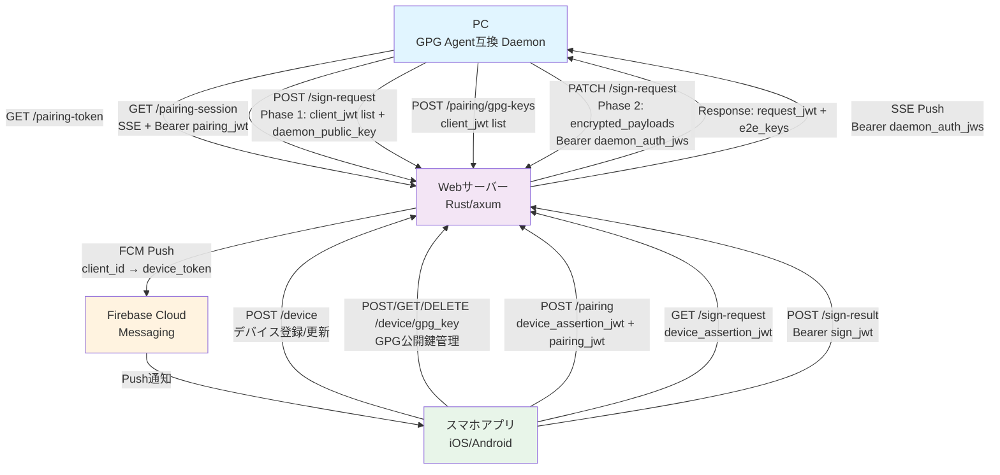

### 13.2 JWT構造
#### 13.2.1 デバイス(device_jwt)
タイプ: JWS (`alg: ES256`, サーバー署名)
```json
{
    "sub": <fid>,
    "payload_type": "device",
    "exp": <timestamp>
}
```

> [!NOTE]
> スマホはdevice_jwtの `exp` を読み取り、残り有効期間が全体の1/3未満になった時点で `POST /device/refresh` により自動更新する。期限切れ後はrefresh不可であり、デバイス再登録（`POST /device`）が必要となる。
認証で利用する場合は、OIDC Client Authentication（private_key_jwt方式）にてクライアントを認証する。スマホはリクエストごとに以下のdevice_assertion_jwtを生成し、`Authorization: Bearer` ヘッダで送信する。

**device_assertion_jwtの構造:**
- **ヘッダー**: `{ "alg": "ES256", "typ": "JWT", "kid": "<公開鍵のkid>" }`
- **ペイロード**:
  - `iss`: `<fid>`（発行者 = スマホのFID）
  - `sub`: `<fid>`（主体 = スマホのFID）
  - `aud`: `<エンドポイントURL>`（対象サーバーURL）
  - `exp`: `<現在時刻 + 60秒>`（短期有効期限）
  - `iat`: `<現在時刻>`（発行時刻）
  - `jti`: `<UUID>`（リプレイ防止用の一意識別子）
- **署名**: ES256（スマホの秘密鍵、Android Keystore / iOS Secure Enclaveに保管）

**サーバー検証手順:**
1. JWTヘッダーの`kid`からclientsテーブルの`public_keys`を検索
2. ES256署名を検証（公開鍵の所有証明）
3. `sub`からFIDを取得しclient_idとして使用
4. `aud`がリクエスト先エンドポイントと一致することを確認
5. `exp`の有効期限、`jti`の一意性を検証（リプレイ防止）

#### 13.2.2 クライアント(client_jwt)
タイプ: JWS（外側）+ JWE（内側） ※サーバー署名のJWSが、サーバー自身が暗号化・復号するJWEをネストする構造

**外側JWS** (`alg: ES256`, サーバー署名):
```json
{
    "exp": <timestamp>,
    "payload_type": "client",
    "client_jwe": "<内側JWE文字列>"
}
```

**内側JWE** (`alg: ECDH-ES`, `enc: A256GCM`, サーバー自身が暗号化・復号するDirect Key Agreement):
```json
{
    "sub": <fid>,
    "pairing_id": <UUID(pairing_token)>
}
```

> [!NOTE]
> Daemonは外側JWSの `exp` を読み取り、残り有効期間が全体の1/3未満になった時点で `POST /pairing/refresh` により自動更新する。内側JWEの復号はサーバーのみが行い、Daemonは不透明データとして扱う。

#### 13.2.3 ペアリング(pairing_jwt)
タイプ: JWS
```json
{
    "sub": <UUID(pairing_token)>,
    "payload_type": "pairing"
}
```

#### 13.2.4 署名リクエスト(request_jwt)
タイプ: JWS
```json
{
    "sub": <UUID(request_id)>,
    "payload_type": "request"
}
```

> [!NOTE]
> Phase 2（PATCH /sign-request）およびSSE（GET /sign-events）では、request_jwtを直接Bearerトークンとして送信せず、Daemonの一時秘密鍵で署名したdaemon_auth_jwsとして送信する。これによりrequest_jwtがPhase 1を開始したDaemonに暗号的にバインドされ、request_jwt漏洩時の不正利用（Phase 2のDoS攻撃、SSEの傍受）を防止する。
>
> **daemon_auth_jwsの構造:**
> ```
> Header: { "alg": "ES256" }
> Payload: {
>   "request_jwt": "<元のrequest_jwt>",
>   "aud": "<エンドポイントURL>",
>   "iat": <timestamp>,
>   "exp": <timestamp>,  // request_jwtのexpと同じ値
>   "jti": "<UUID>"      // リプレイ防止用
> }
> Signature: Daemonの一時秘密鍵で署名
> ```
> `daemon_public_key`はPhase 1のPOST /sign-requestで送信され、`requests.daemon_public_key`に保存される。

#### 13.2.5 署名トークン(sign_jwt)
タイプ: JWS
```json
{
    "sub": <UUID(request_id)>,
    "client_id": <fid>,
    "payload_type": "sign"
}
```

> [!NOTE]
> `client_id` を含めることで、サーバーが `POST /sign-result` 受信時にsign_jwtの発行先デバイスを検証できる。複数デバイスへの署名要求時、別デバイス向けのsign_jwtの不正使用を防止する。

### 13.3 シーケンスダイアグラム
#### 13.3.1 デバイス登録フロー

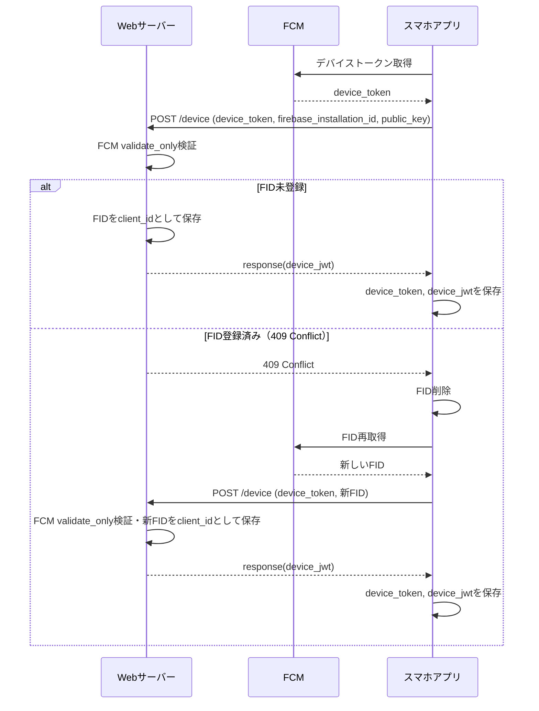

#### 13.3.2 デバイス更新フロー

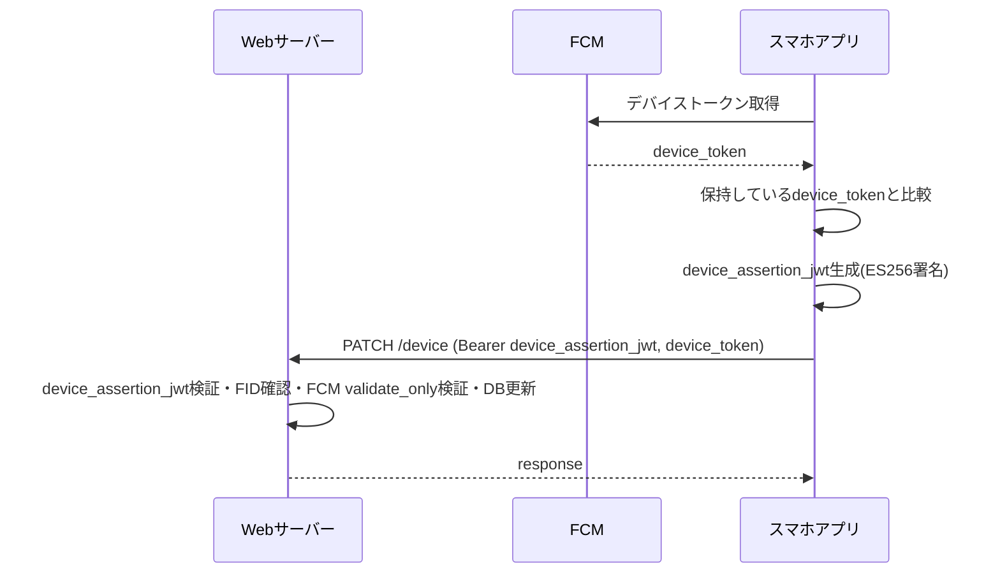

#### 13.3.3 初期ペアリングフロー

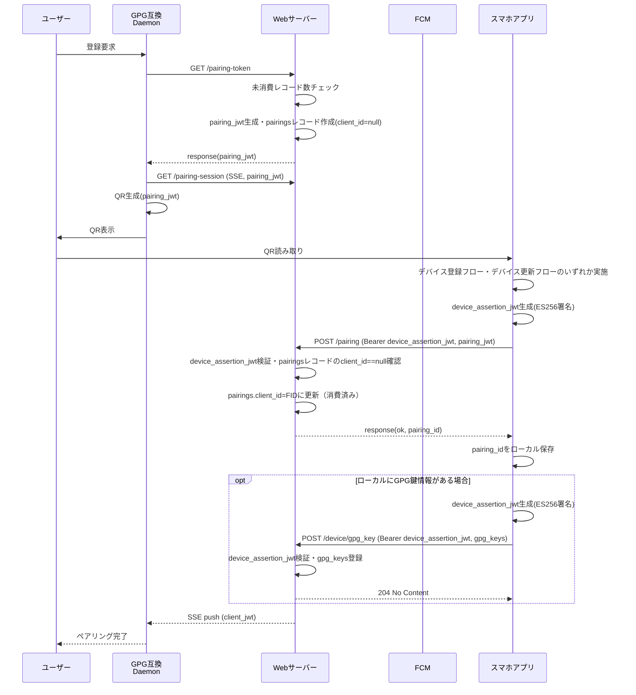

#### 13.3.4 GPG鍵登録フロー

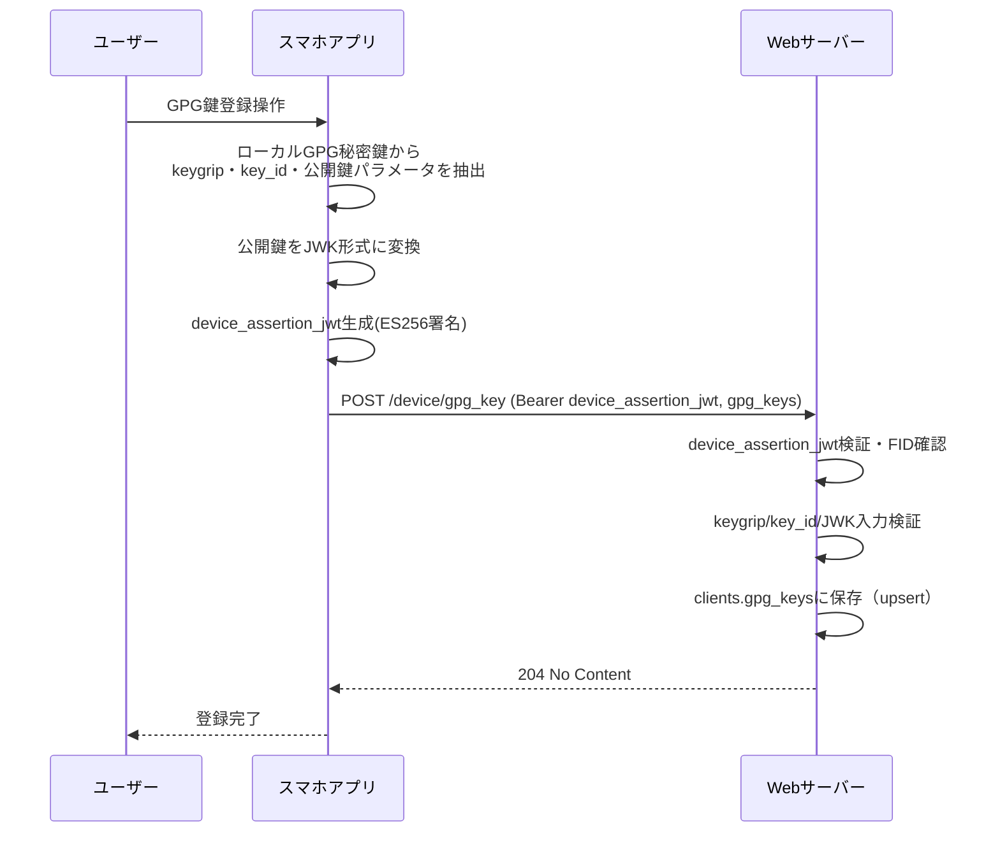

> [!NOTE]
> GPG鍵の登録はペアリングとは独立した操作である。ペアリング完了後、スマホアプリから任意のタイミングでGPG公開鍵を登録・更新・削除できる。DaemonはGPG鍵情報をサーバー経由で取得するため、スマホでの鍵登録後にDaemonの再起動は不要（キャッシュミス時にサーバーへ再取得を行うため）。

#### 13.3.5 署名フロー

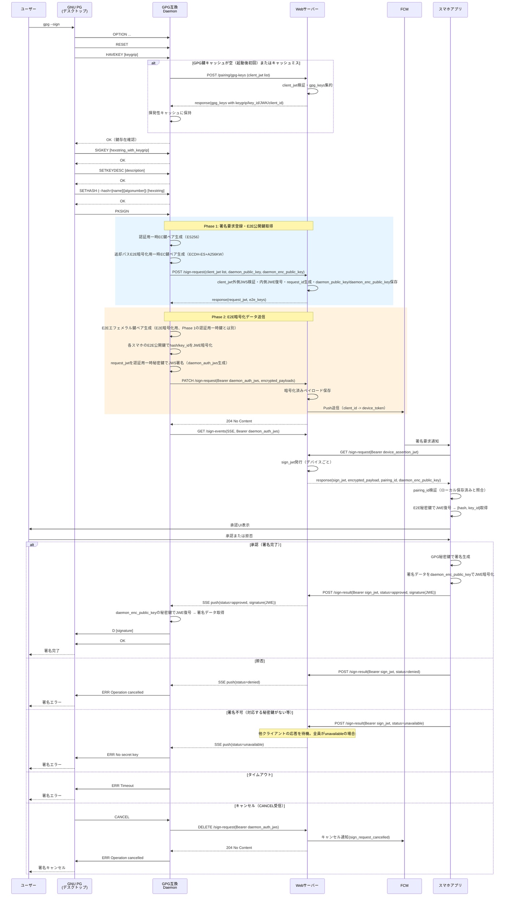

#### 13.3.6 PKDECRYPTフロー（将来拡張）

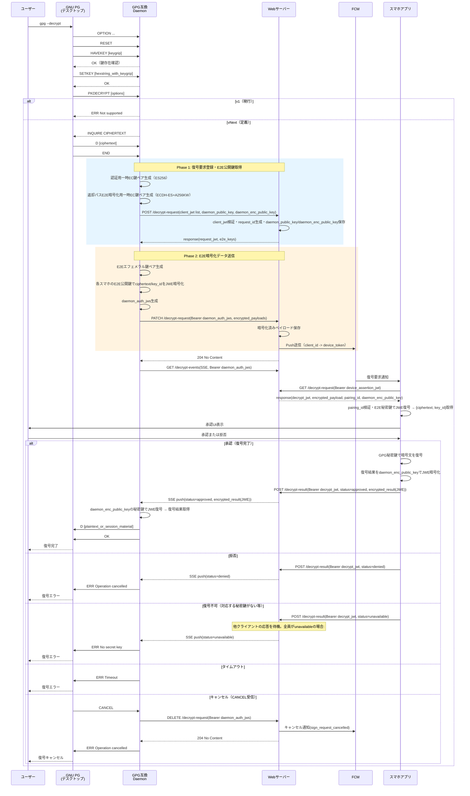

#### 13.3.7 AUTHフロー（将来拡張）

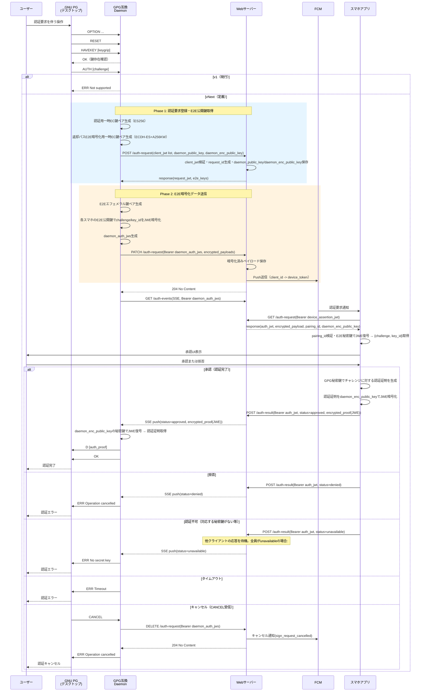

### 13.4 認証フロー

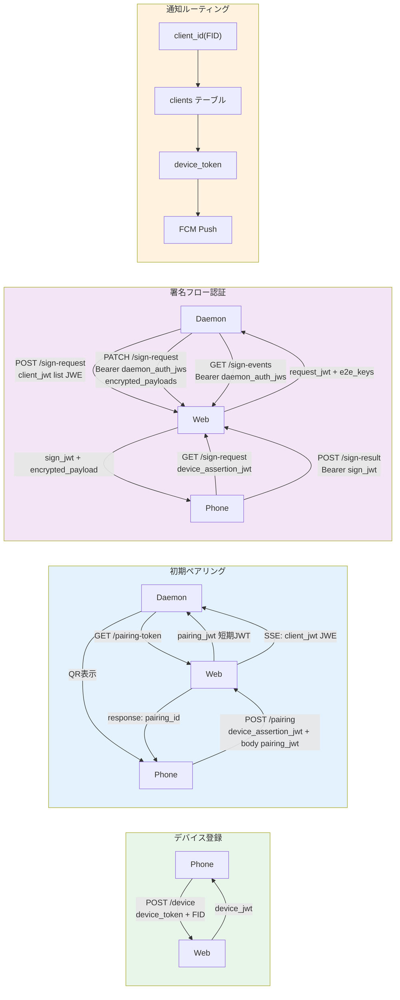

### 13.5 署名要求の状態遷移図

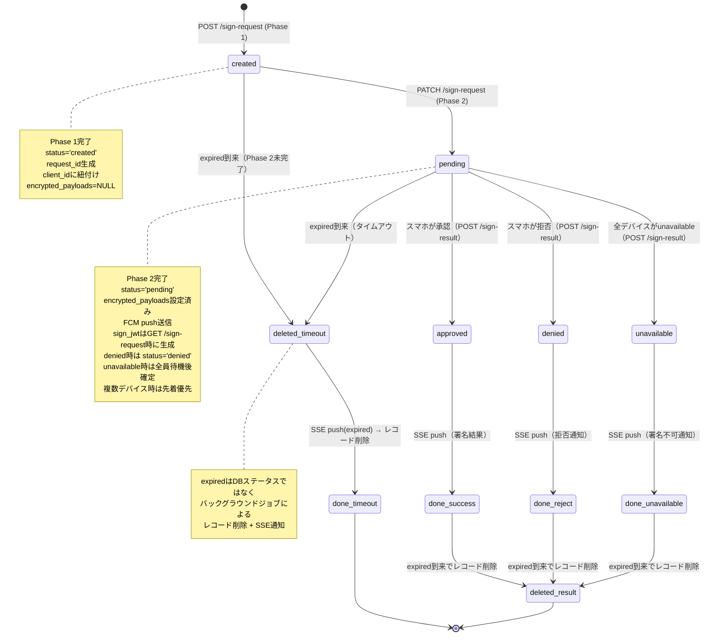

### 13.6 API通信フロー図

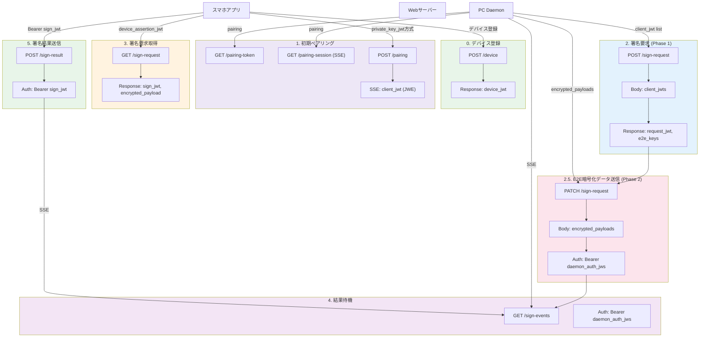

### 13.7 ネットワークトポロジー

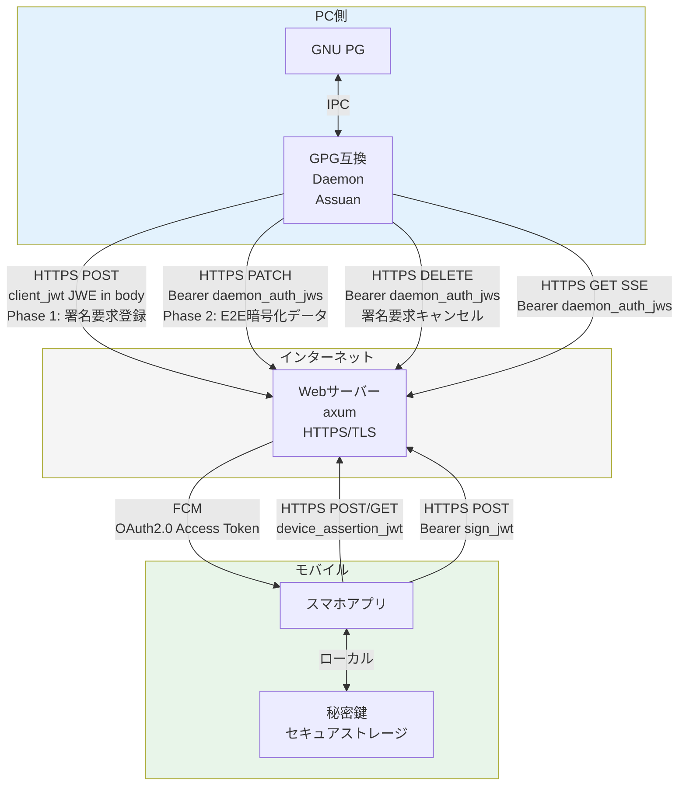

### 13.8 エラーシナリオと状態遷移図（失敗パス）

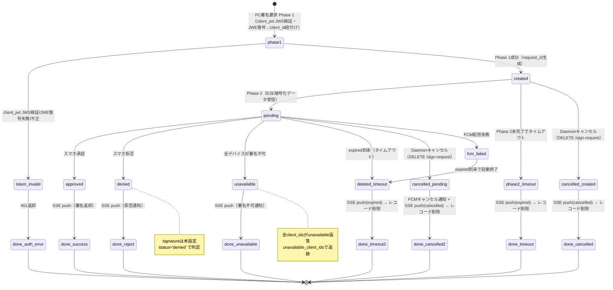

### 13.9 エラーハンドリングフロー

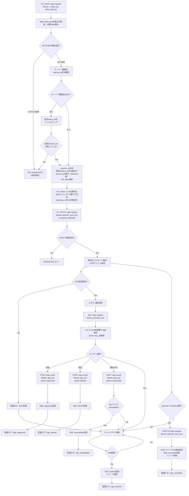
